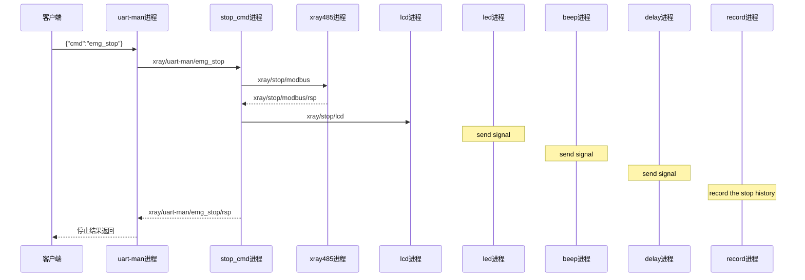

### 5. 紧急停止命令 (stop_msg)--66

```mermaid
sequenceDiagram
    participant Client as 客户端
    participant uartMan as uart-man进程
    participant StopCmd as stop_cmd进程
    participant Xray485 as xray485进程
    participant LCD as lcd进程
    participant LED as led进程
    participant Beep as beep进程
    participant Delay as delay进程
    participant Record as record进程

    Client->>uartMan: {"cmd":"emg_stop"}
    uartMan->>StopCmd: xray/uart-man/emg_stop
    StopCmd->>Xray485: xray/stop/modbus
    Xray485-->>StopCmd: xray/stop/modbus/rsp
    StopCmd->>LCD: xray/stop/lcd

	note over LED : send signal
	note over Beep : send signal
	note over Delay : send signal
	note over Record : record the stop history

    StopCmd-->>uartMan: xray/uart-man/emg_stop/rsp
    uartMan-->>Client: 停止结果返回

```
