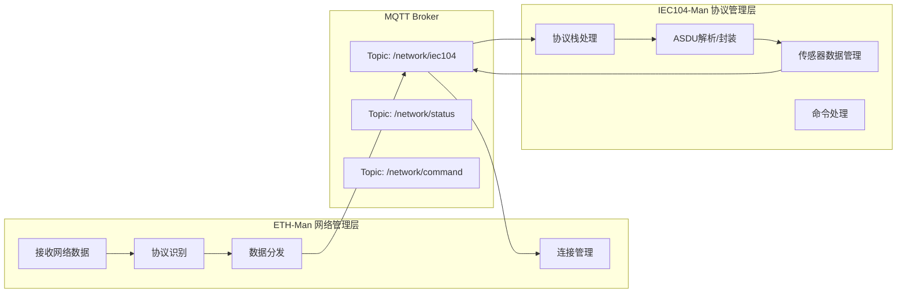
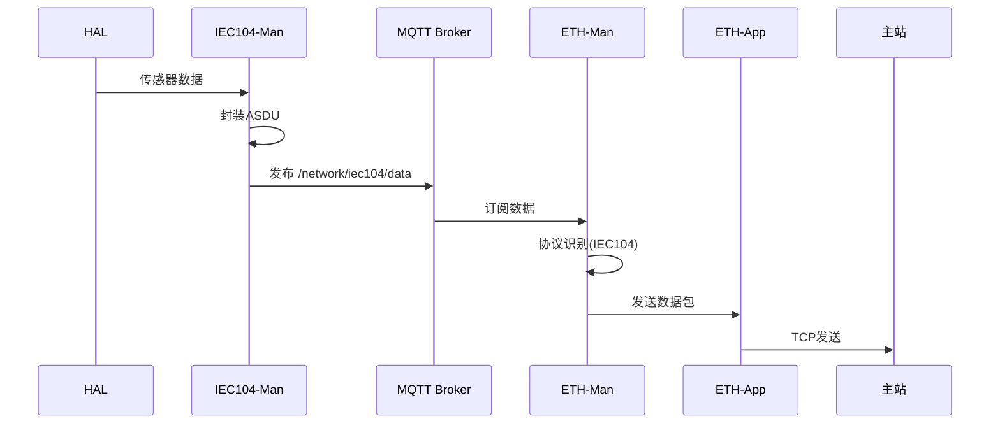
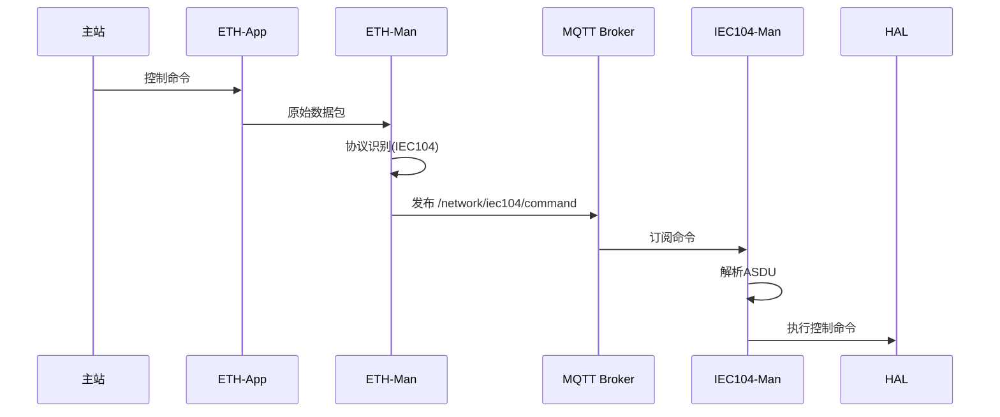
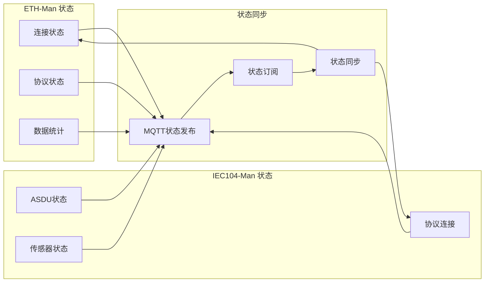
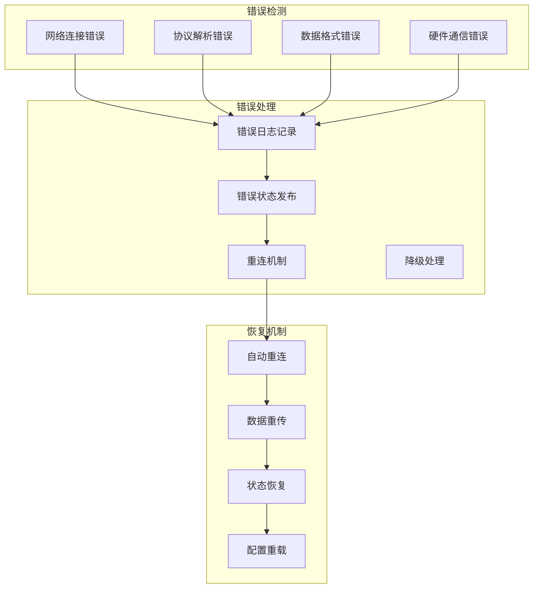
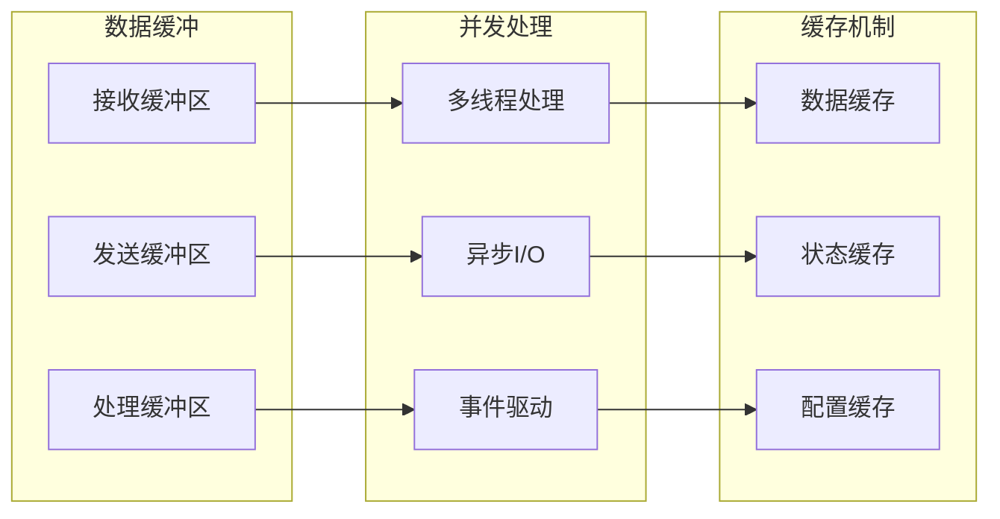

## 数据流向架构



## 详细数据交流逻辑

### 1. 数据上行流程（传感器数据 → 主站）



### 2. 数据下行流程（主站命令 → 硬件）



## MQTT Topic 设计

```mermaid
graph TD
    subgraph "MQTT Topic 结构"
        T1[/network/iec104/data]
        T2[/network/iec104/command]
        T3[/network/iec104/status]
        T4[/network/iec104/heartbeat]
        T5[/network/iec104/config]
    end
    
    subgraph "数据流向"
        D1[传感器数据] --> T1
        T1 --> D2[网络发送]
        D3[主站命令] --> T2
        T2 --> D4[硬件控制]
        D5[连接状态] --> T3
        D6[心跳包] --> T4
        D7[配置更新] --> T5
    end
```

## 消息格式设计

### 数据上行消息格式
```json
{
    "topic": "/network/iec104/data",
    "payload": {
        "protocol": "IEC104",
        "type": "data",
        "timestamp": 1640995200,
        "data": {
            "ioa": 1001,
            "value": 25.6,
            "quality": "GOOD",
            "type": "M_ME_TE_1"
        }
    }
}
```

### 数据下行消息格式
```json
{
    "topic": "/network/iec104/command",
    "payload": {
        "protocol": "IEC104",
        "type": "command",
        "timestamp": 1640995200,
        "data": {
            "ioa": 2001,
            "command": "C_SC_NA_1",
            "value": true,
            "cot": "ACTIVATION"
        }
    }
}
```

## 状态管理



## 错误处理机制



## 性能优化



这个设计通过MQTT Broker实现了ETH-Man和IEC104-Man之间的松耦合通信，支持双向数据流、状态同步和错误处理。