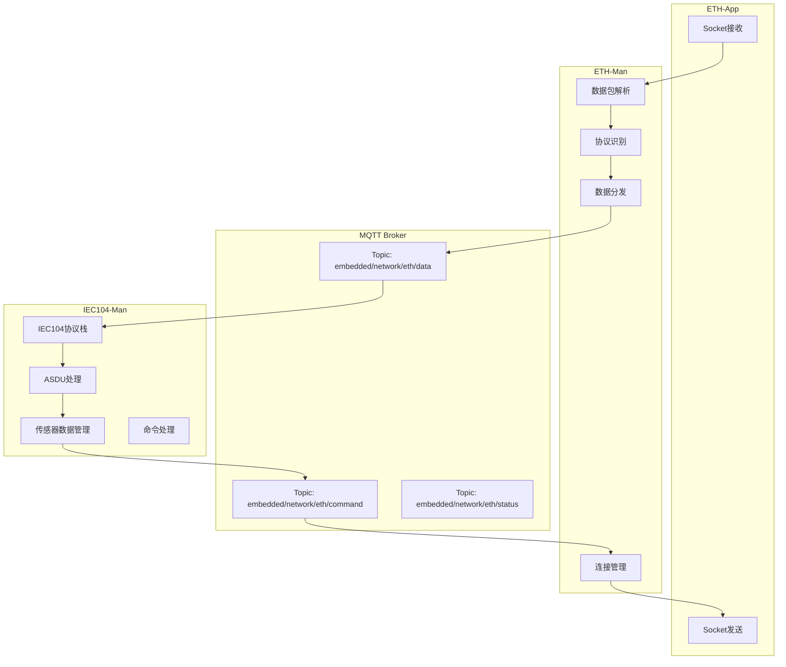
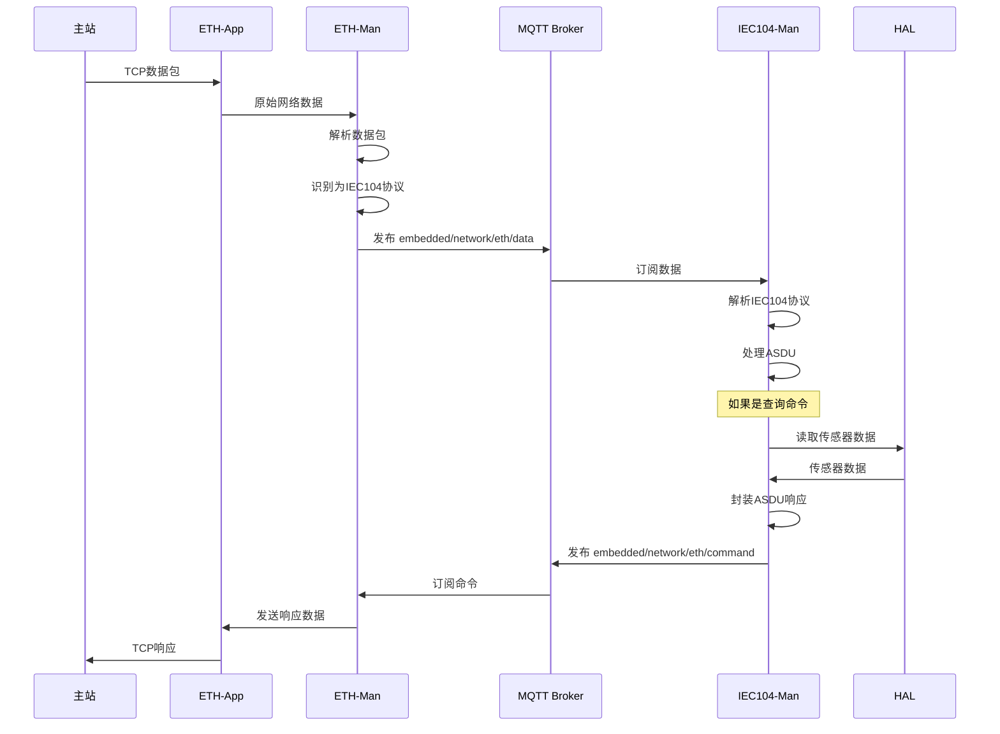
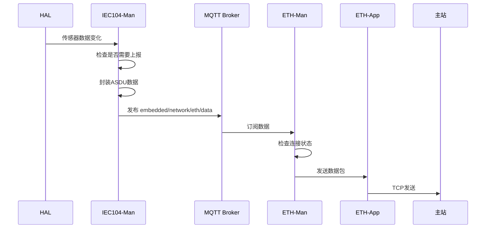
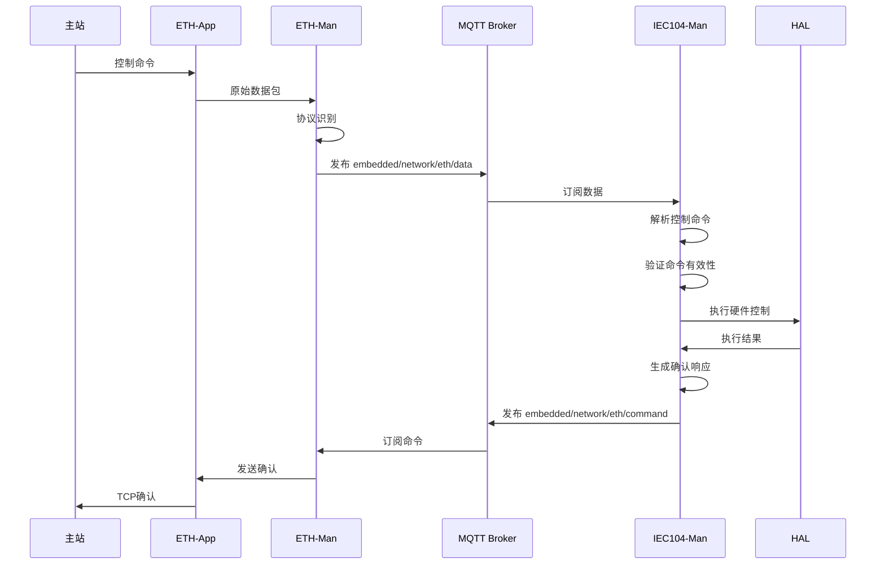
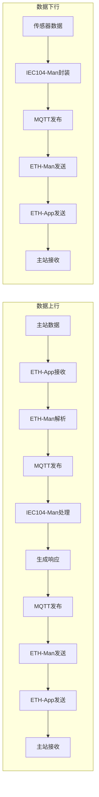
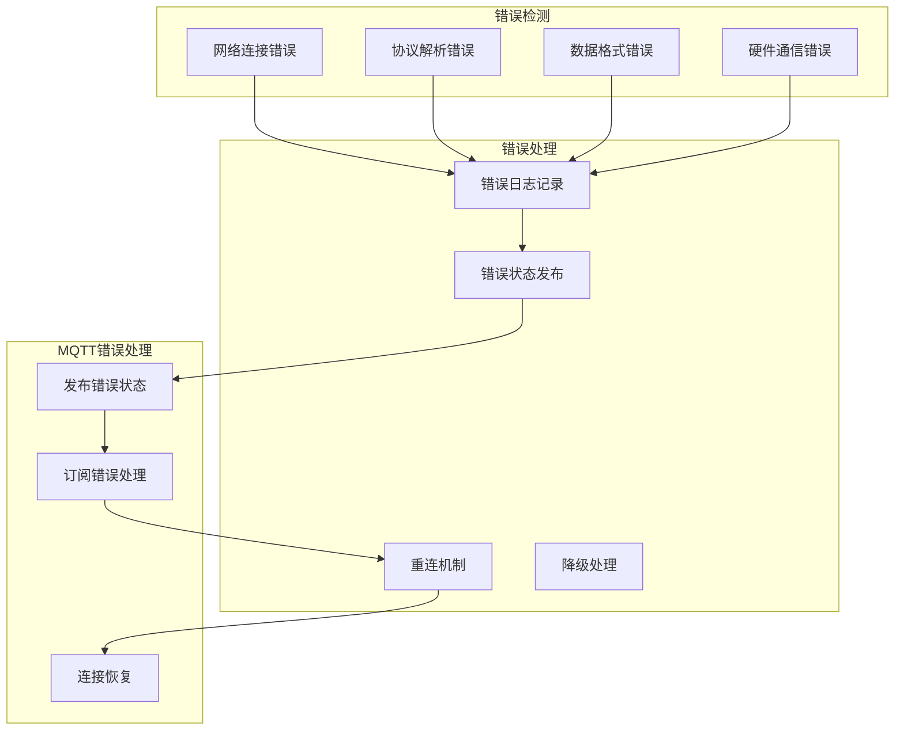
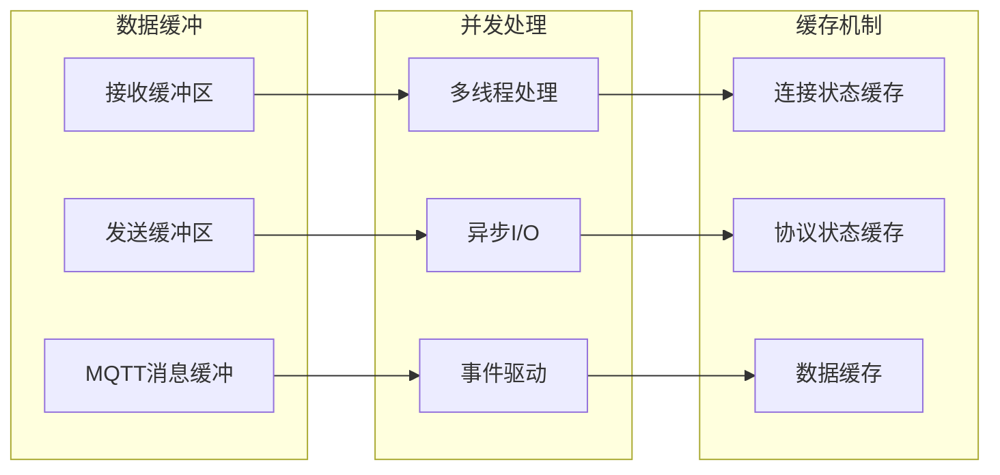

## 整体架构



## 详细数据交流逻辑

### 1. 数据上行流程（主站 → 传感器数据）



### 2. 数据下行流程（传感器数据 → 主站）



### 3. 控制命令流程（主站 → 硬件控制）



## MQTT Topic 设计

### 核心Topics
```
embedded/network/eth/data      # 网络数据交换
embedded/network/eth/command   # 命令响应
embedded/network/eth/status    # 状态信息
```

### 消息格式

#### 网络数据消息
```json
{
    "topic": "embedded/network/eth/data",
    "payload": {
        "direction": "in",           // in: 接收, out: 发送
        "timestamp": 1640995200,
        "source": "192.168.1.100:2404",
        "protocol": "IEC104",
        "data": {
            "length": 256,
            "type": "I-Frame",
            "content": "68 01 00 01 00 01 01 01 01 01..."
        }
    }
}
```

#### 命令响应消息
```json
{
    "topic": "embedded/network/eth/command",
    "payload": {
        "direction": "out",
        "timestamp": 1640995200,
        "target": "192.168.1.100:2404",
        "protocol": "IEC104",
        "command": {
            "type": "response",
            "asdu_type": "M_ME_TE_1",
            "ioa": 1001,
            "value": 25.6,
            "quality": "GOOD"
        }
    }
}
```

#### 状态消息
```json
{
    "topic": "embedded/network/eth/status",
    "payload": {
        "timestamp": 1640995200,
        "connection": {
            "status": "connected",
            "remote_ip": "192.168.1.100",
            "remote_port": 2404,
            "uptime": 3600
        },
        "statistics": {
            "bytes_sent": 10240,
            "bytes_received": 8192,
            "packets_sent": 100,
            "packets_received": 80
        }
    }
}
```

## 数据流向图



## 错误处理机制



## 性能优化



这个重新梳理的逻辑清晰地展示了ETH-Man和IEC104-Man之间通过MQTT Broker的数据交流机制，包括数据上行、下行、控制命令和错误处理等完整流程。