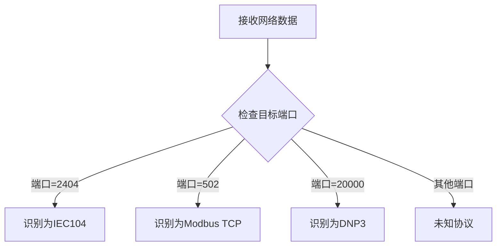
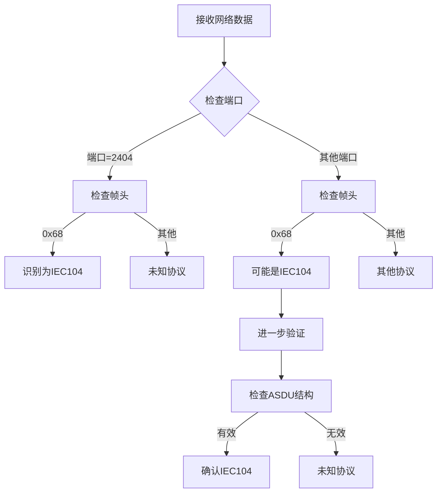
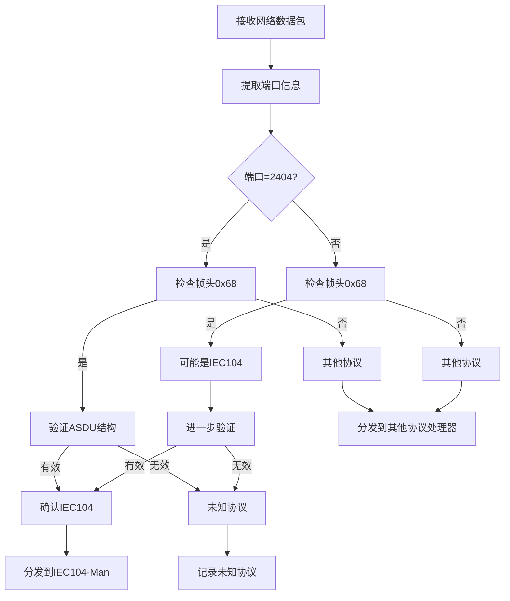

## 协议识别方法

### 1. 端口识别法


### 2. 数据包特征识别法

Read file: lib60870-C/src/iec60870/cs104/cs104_frame.c
基于lib60870的源码分析，ETH-Man可以通过以下方式识别IEC104协议：

## IEC104协议识别方法

### 1. **帧头识别法**
```c
// IEC104协议帧特征
#define IEC104_FRAME_START 0x68  // 帧起始标识
#define IEC104_FRAME_MIN_SIZE 6  // 最小帧长度

bool isIEC104Protocol(const uint8_t* data, int length) {
    // 检查帧起始标识
    if (data[0] != IEC104_FRAME_START) {
        return false;
    }
    
    // 检查最小长度
    if (length < IEC104_FRAME_MIN_SIZE) {
        return false;
    }
    
    // 检查长度字段
    uint8_t declared_length = data[1];
    if (length != (declared_length + 2)) {
        return false;
    }
    
    return true;
}
```

### 2. **端口识别法**
```c
typedef enum {
    PROTOCOL_UNKNOWN = 0,
    PROTOCOL_IEC104 = 1,
    PROTOCOL_MODBUS_TCP = 2,
    PROTOCOL_DNP3 = 3
} ProtocolType_t;

ProtocolType_t identifyProtocolByPort(uint16_t port) {
    switch (port) {
        case 2404:  // IEC60870-5-104标准端口
            return PROTOCOL_IEC104;
        case 502:   // Modbus TCP标准端口
            return PROTOCOL_MODBUS_TCP;
        case 20000: // DNP3标准端口
            return PROTOCOL_DNP3;
        default:
            return PROTOCOL_UNKNOWN;
    }
}
```

### 3. **综合识别法**


### 4. **ASDU类型识别**
```c
// IEC104 ASDU类型定义
typedef enum {
    M_SP_NA_1 = 1,    // 单点信息
    M_DP_NA_1 = 3,    // 双点信息
    M_ME_NA_1 = 9,    // 测量值，标度化值
    M_ME_NB_1 = 11,   // 测量值，标度化值
    M_ME_NC_1 = 13,   // 测量值，短浮点数
    C_SC_NA_1 = 45,   // 单命令
    C_DC_NA_1 = 46,   // 双命令
    C_IC_NA_1 = 100,  // 总召唤命令
    C_CI_NA_1 = 101   // 电能脉冲召唤命令
} IEC104_ASDU_Type_t;

bool validateIEC104ASDU(const uint8_t* data, int length) {
    if (length < 6) return false;
    
    // 检查ASDU类型是否有效
    uint8_t asdu_type = data[6];
    switch (asdu_type) {
        case M_SP_NA_1:
        case M_DP_NA_1:
        case M_ME_NA_1:
        case M_ME_NB_1:
        case M_ME_NC_1:
        case C_SC_NA_1:
        case C_DC_NA_1:
        case C_IC_NA_1:
        case C_CI_NA_1:
            return true;
        default:
            return false;
    }
}
```

### 5. **完整识别流程**
```c
typedef struct {
    uint16_t port;
    uint8_t* data;
    int length;
    uint32_t timestamp;
} NetworkPacket_t;

ProtocolType_t ETH_Man_IdentifyProtocol(NetworkPacket_t* packet) {
    ProtocolType_t protocol = PROTOCOL_UNKNOWN;
    
    // 1. 端口识别
    protocol = identifyProtocolByPort(packet->port);
    
    // 2. 如果端口不明确，进行帧头识别
    if (protocol == PROTOCOL_UNKNOWN) {
        if (isIEC104Protocol(packet->data, packet->length)) {
            protocol = PROTOCOL_IEC104;
        }
    }
    
    // 3. 进一步验证（对于IEC104）
    if (protocol == PROTOCOL_IEC104) {
        if (!validateIEC104ASDU(packet->data, packet->length)) {
            protocol = PROTOCOL_UNKNOWN;
        }
    }
    
    return protocol;
}
```

### 6. **协议分发逻辑**
```c
void ETH_Man_ProcessPacket(NetworkPacket_t* packet) {
    ProtocolType_t protocol = ETH_Man_IdentifyProtocol(packet);
    
    switch (protocol) {
        case PROTOCOL_IEC104:
            // 发布到IEC104-Man
            publishToMQTT("embedded/network/eth/data", packet);
            break;
            
        case PROTOCOL_MODBUS_TCP:
            // 发布到Modbus-Man（未来扩展）
            publishToMQTT("embedded/network/eth/modbus", packet);
            break;
            
        case PROTOCOL_DNP3:
            // 发布到DNP3-Man（未来扩展）
            publishToMQTT("embedded/network/eth/dnp3", packet);
            break;
            
        default:
            // 未知协议，记录日志
            logUnknownProtocol(packet);
            break;
    }
}
```

## 识别流程图



这种多层次的识别方法确保了协议识别的准确性和可靠性。