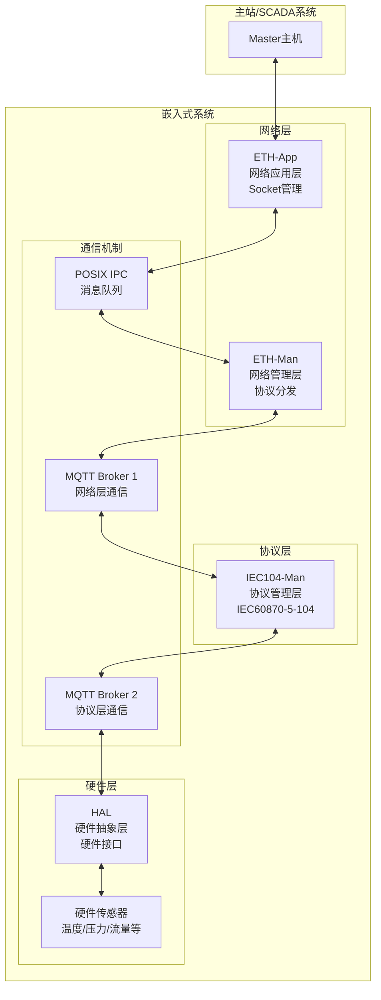
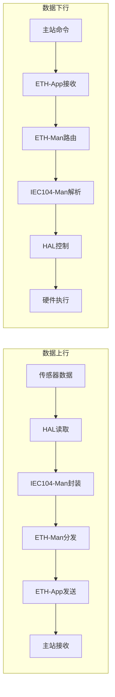
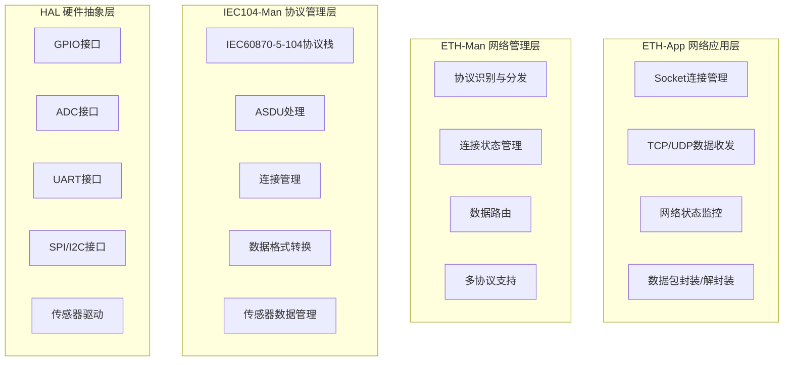
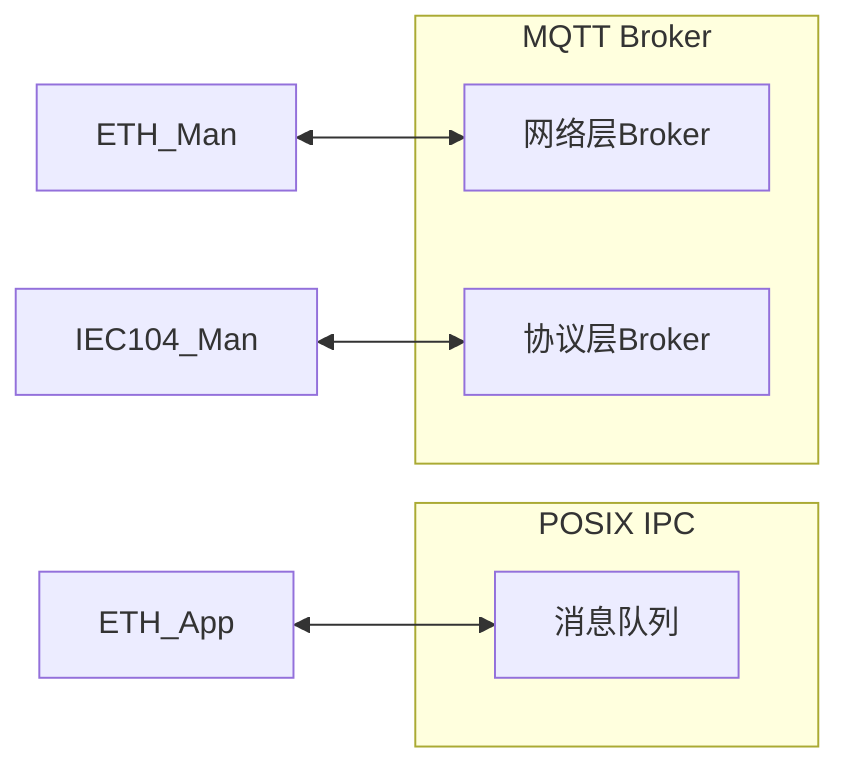
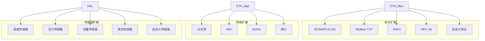
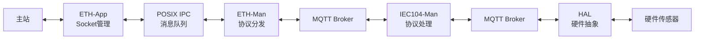

## 整体架构

```mermaid
graph TB
    subgraph "主站/SCADA系统"
        Master[Master主机]
    end
    
    subgraph "嵌入式系统"
        subgraph "网络层"
            ETH_App[ETH-App<br/>网络应用层<br/>Socket管理]
            ETH_Man[ETH-Man<br/>网络管理层<br/>协议分发]
        end
        
        subgraph "协议层"
            IEC104_Man[IEC104-Man<br/>协议管理层<br/>IEC60870-5-104]
        end
        
        subgraph "硬件层"
            HAL[HAL<br/>硬件抽象层<br/>硬件接口]
            HW[硬件传感器<br/>温度/压力/流量等]
        end
        
        subgraph "通信机制"
            MQTT1[MQTT Broker 1<br/>网络层通信]
            MQTT2[MQTT Broker 2<br/>协议层通信]
            IPC[POSIX IPC<br/>消息队列]
        end
    end
    
    Master <--> ETH_App
    ETH_App <--> IPC
    IPC <--> ETH_Man
    ETH_Man <--> MQTT1
    MQTT1 <--> IEC104_Man
    IEC104_Man <--> MQTT2
    MQTT2 <--> HAL
    HAL <--> HW
```

## 数据流向

```mermaid
flowchart LR
    subgraph "数据上行"
        A[传感器数据] --> B[HAL读取]
        B --> C[IEC104-Man封装]
        C --> D[ETH-Man分发]
        D --> E[ETH-App发送]
        E --> F[主站接收]
    end
    
    subgraph "数据下行"
        G[主站命令] --> H[ETH-App接收]
        H --> I[ETH-Man路由]
        I --> J[IEC104-Man解析]
        J --> K[HAL控制]
        K --> L[硬件执行]
    end
```

## 模块职责

```mermaid
graph TD
    subgraph "ETH-App 网络应用层"
        A1[Socket连接管理]
        A2[TCP/UDP数据收发]
        A3[网络状态监控]
        A4[数据包封装/解封装]
    end
    
    subgraph "ETH-Man 网络管理层"
        B1[协议识别与分发]
        B2[连接状态管理]
        B3[数据路由]
        B4[多协议支持]
    end
    
    subgraph "IEC104-Man 协议管理层"
        C1[IEC60870-5-104协议栈]
        C2[ASDU处理]
        C3[连接管理]
        C4[数据格式转换]
        C5[传感器数据管理]
    end
    
    subgraph "HAL 硬件抽象层"
        D1[GPIO接口]
        D2[ADC接口]
        D3[UART接口]
        D4[SPI/I2C接口]
        D5[传感器驱动]
    end
```

## 通信机制

```mermaid
graph LR
    subgraph "POSIX IPC"
        IPC1[消息队列]
    end
    
    subgraph "MQTT Broker"
        MQTT1[网络层Broker]
        MQTT2[协议层Broker]
    end
    
    ETH_App <--> IPC1
    ETH_Man <--> MQTT1
    IEC104_Man <--> MQTT2
```

## 扩展性设计

```mermaid
graph TB
    subgraph "协议扩展"
        P1[IEC60870-5-104]
        P2[Modbus TCP]
        P3[DNP3]
        P4[OPC UA]
        P5[自定义协议]
    end
    
    subgraph "网络扩展"
        N1[以太网]
        N2[WiFi]
        N3[4G/5G]
        N4[串口]
    end
    
    subgraph "传感器扩展"
        S1[温度传感器]
        S2[压力传感器]
        S3[流量传感器]
        S4[液位传感器]
        S5[自定义传感器]
    end
    
    ETH_Man --> P1
    ETH_Man --> P2
    ETH_Man --> P3
    ETH_Man --> P4
    ETH_Man --> P5
    
    ETH_App --> N1
    ETH_App --> N2
    ETH_App --> N3
    ETH_App --> N4
    
    HAL --> S1
    HAL --> S2
    HAL --> S3
    HAL --> S4
    HAL --> S5
```

## 简化架构

```mermaid
graph LR
    Master[主站] <--> ETH_App[ETH-App<br/>Socket管理]
    ETH_App <--> IPC[POSIX IPC<br/>消息队列]
    IPC <--> ETH_Man[ETH-Man<br/>协议分发]
    ETH_Man <--> MQTT1[MQTT Broker]
    MQTT1 <--> IEC104_Man[IEC104-Man<br/>协议处理]
    IEC104_Man <--> MQTT2[MQTT Broker]
    MQTT2 <--> HAL[HAL<br/>硬件抽象]
    HAL <--> HW[硬件传感器]
```

这个修正版的架构图去掉了Data-Man和Device-Man层，直接通过IEC104-Man管理传感器数据，架构更加简洁。