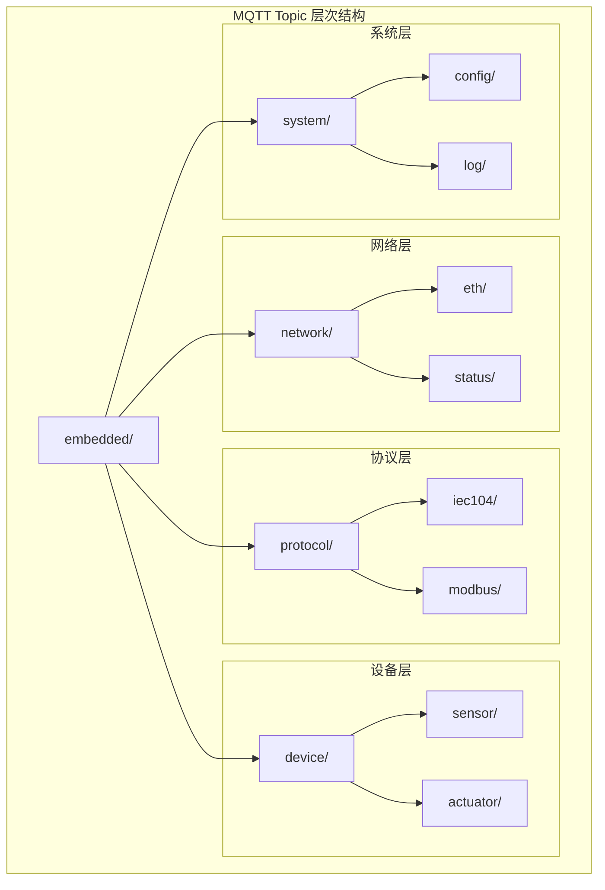
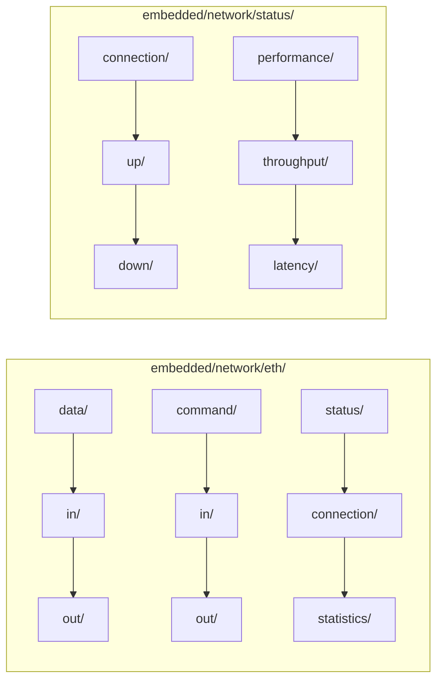
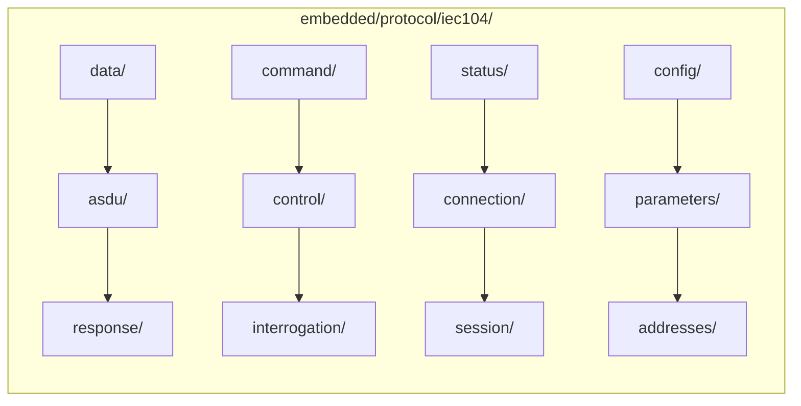
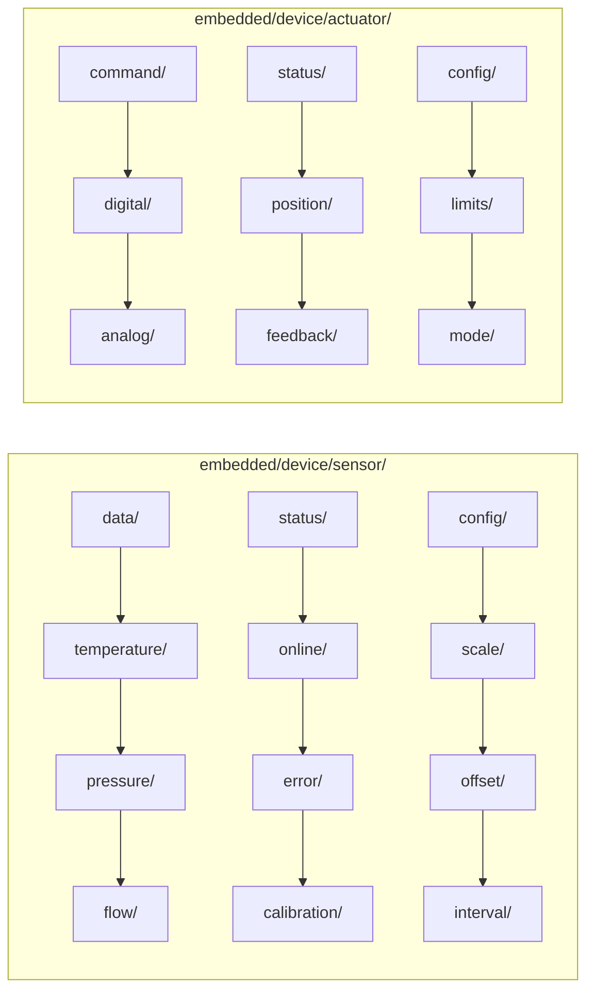
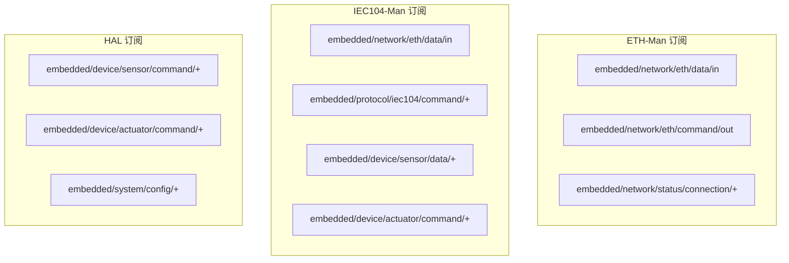

## 整体Topic架构



## 详细Topic设计

### 1. 网络层Topics



### 2. 协议层Topics



### 3. 设备层Topics



## 完整Topic列表

### 网络层Topics
```
embedded/network/eth/data/in          # 接收到的网络数据
embedded/network/eth/data/out         # 发送的网络数据
embedded/network/eth/command/in       # 接收到的网络命令
embedded/network/eth/command/out      # 发送的网络命令
embedded/network/eth/status/connection # 网络连接状态
embedded/network/eth/status/statistics # 网络统计信息
embedded/network/status/connection/up   # 连接建立
embedded/network/status/connection/down # 连接断开
embedded/network/status/performance/throughput # 吞吐量
embedded/network/status/performance/latency   # 延迟
```

### 协议层Topics
```
embedded/protocol/iec104/data/asdu        # IEC104 ASDU数据
embedded/protocol/iec104/data/response    # IEC104响应数据
embedded/protocol/iec104/command/control  # IEC104控制命令
embedded/protocol/iec104/command/interrogation # IEC104查询命令
embedded/protocol/iec104/status/connection # IEC104连接状态
embedded/protocol/iec104/status/session   # IEC104会话状态
embedded/protocol/iec104/config/parameters # IEC104协议参数
embedded/protocol/iec104/config/addresses # IEC104地址配置
```

### 设备层Topics
```
embedded/device/sensor/data/temperature   # 温度传感器数据
embedded/device/sensor/data/pressure      # 压力传感器数据
embedded/device/sensor/data/flow          # 流量传感器数据
embedded/device/sensor/status/online      # 传感器在线状态
embedded/device/sensor/status/error       # 传感器错误状态
embedded/device/sensor/status/calibration # 传感器校准状态
embedded/device/sensor/config/scale       # 传感器比例因子
embedded/device/sensor/config/offset      # 传感器偏移量
embedded/device/sensor/config/interval    # 传感器采样间隔
embedded/device/actuator/command/digital  # 数字输出命令
embedded/device/actuator/command/analog   # 模拟输出命令
embedded/device/actuator/status/position  # 执行器位置状态
embedded/device/actuator/status/feedback  # 执行器反馈状态
embedded/device/actuator/config/limits    # 执行器限位配置
embedded/device/actuator/config/mode      # 执行器模式配置
```

### 系统层Topics
```
embedded/system/config/network    # 网络配置
embedded/system/config/protocol   # 协议配置
embedded/system/config/device     # 设备配置
embedded/system/config/system     # 系统配置
embedded/system/log/info          # 信息日志
embedded/system/log/warning       # 警告日志
embedded/system/log/error         # 错误日志
embedded/system/log/debug         # 调试日志
```

## 消息格式示例

### 网络数据消息
```json
{
    "topic": "embedded/network/eth/data/in",
    "payload": {
        "timestamp": 1640995200,
        "source": "192.168.1.100:2404",
        "protocol": "IEC104",
        "data": {
            "length": 256,
            "type": "I-Frame",
            "content": "68 01 00 01 00 01 01 01 01 01..."
        }
    }
}
```

### 传感器数据消息
```json
{
    "topic": "embedded/device/sensor/data/temperature",
    "payload": {
        "timestamp": 1640995200,
        "sensor_id": "TEMP_001",
        "value": 25.6,
        "unit": "°C",
        "quality": "GOOD",
        "location": "TANK_01"
    }
}
```

### 控制命令消息
```json
{
    "topic": "embedded/protocol/iec104/command/control",
    "payload": {
        "timestamp": 1640995200,
        "command_id": "CMD_001",
        "ioa": 2001,
        "command": "C_SC_NA_1",
        "value": true,
        "cot": "ACTIVATION",
        "priority": "HIGH"
    }
}
```

## Topic订阅策略



这个重新设计的Topic结构具有清晰的层次关系，便于扩展和维护，同时支持细粒度的消息过滤和路由。