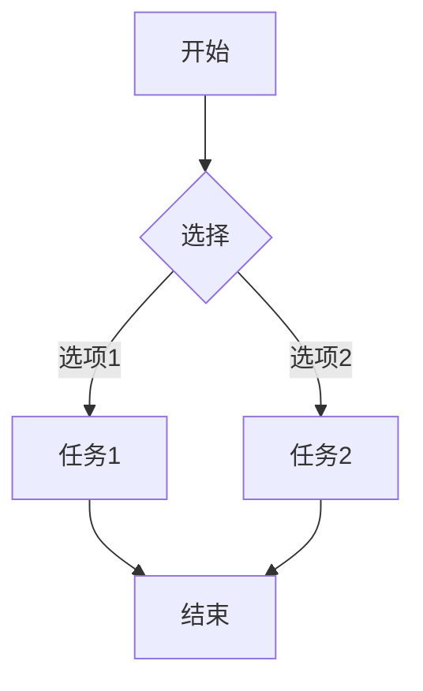
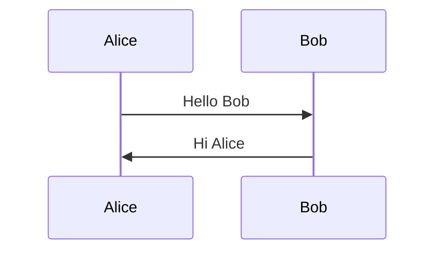
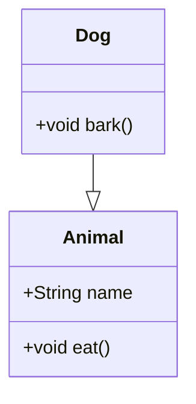
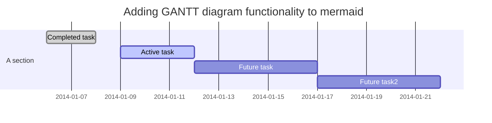

--- 
# 定义
Mermaid 是一种基于文本的图表绘制工具，它允许用户通过简单的文本语法来描述图表，然后自动生成对应的可视化图形。Mermaid 的核心理念是“用代码来绘制图表”，这种方式既简洁又高效，特别适合开发者和技术人员快速创建和维护图表。

--- 
# 应用场景
- **技术文档**：在技术文档中嵌入流程图、类图等，帮助读者更好地理解系统架构和逻辑。
    
- **项目管理**：使用甘特图来展示项目进度，通过用户旅程图来描述用户体验。
    
- **系统设计**：通过类图和实体关系图来设计和展示系统的数据结构。
    
- **个人笔记**：在笔记工具中使用 Mermaid 来整理思路，例如在 Obsidian 中绘制思维导图。

### **Mermaid 的基本语法**

以下是 Mermaid 的一些基本语法示例：

#### 流程图

#### 时序图

#### 类图

#### 甘特图

### **Mermaid 的优势**

- **简洁高效**：通过文本语法快速生成图表，无需复杂的绘图工具。
    
- **易于维护**：文本格式便于版本控制和团队协作。
    
- **灵活性强**：支持多种图表类型，适应多种场景。
    
- **实时反馈**：编辑时可以实时看到图表的变化。
    
### **Mermaid 的局限性**

- **复杂图表的限制**：对于非常复杂的图表，Mermaid 可能不如专业的绘图工具（如 Visio）灵活。
    
- **渲染依赖**：需要支持 Mermaid 的工具或环境来正确渲染图表。
    

### **总结**

Mermaid 是一种强大的文本图表工具，特别适合开发者和技术人员。它通过简洁的语法和丰富的图表类型，帮助用户快速创建和维护图表，同时与 Markdown 的集成使其在技术文档和笔记中表现出色。