flowchart TD
    A[开始] --> B[解析命令行参数]
    B --> C[设置信号处理函数]
    C --> D[创建应用上下文]
    D --> E[初始化消息队列]
    E --> F{消息队列初始化成功?}
    F -->|否| G[报错并退出]
    F -->|是| H[初始化RS485串口]
    H --> I{RS485初始化成功?}
    I -->|否| J[报错并清理资源]
    I -->|是| K[主循环开始]
    
    K --> L{检查IEC到RS485队列}
    L --> M{有命令消息?}
    M -->|是| N[处理命令消息]
    M -->|否| O{检查RS485串口数据}
    N --> O
    
    O --> P{有数据?}
    P -->|是| Q[处理RS485数据并发送到IEC]
    P -->|否| R[短暂休眠]
    Q --> R
    
    R --> S{运行标志为true?}
    S -->|是| L
    S -->|否| T[清理资源]
    T --> U[结束]


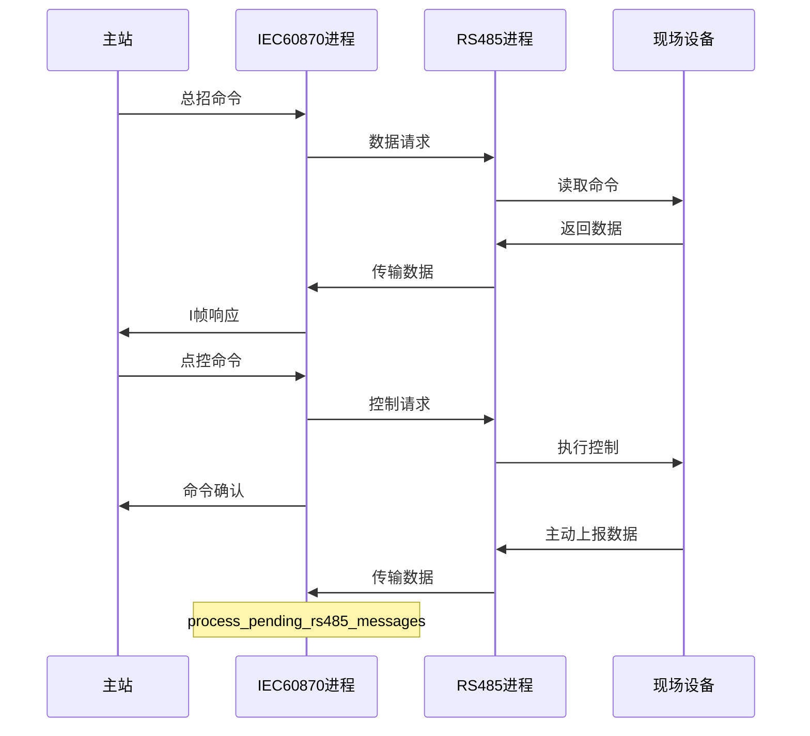


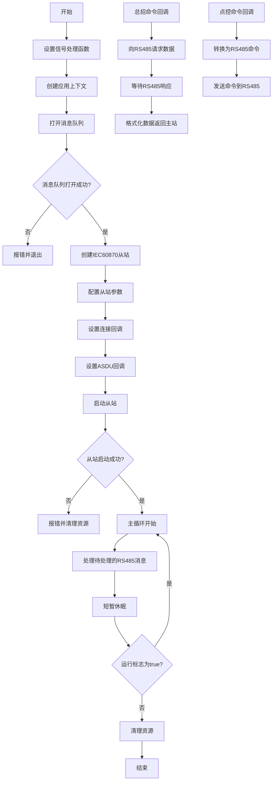


# interrogationHandler 函数流程图（Markdown格式）

## 基本流程

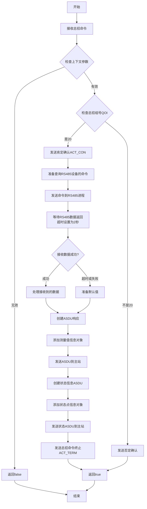

## 详细数据处理流程

```mermaid
flowchart TD
    A[接收RS485数据] --> B{数据接收成功?}
    
    B -->|成功| C[提取温度数据]
    B -->|失败| D[使用无效品质位<br>创建默认值]
    
    C --> C1{数据长度>=2?}
    C1 -->|是| C2[提取温度值<br>data[0]<<8 | data[1]]
    C1 -->|否| C3[使用默认温度值]
    
    C2 --> E[创建测量值对象<br>IOA=100]
    C3 --> E
    D --> E
    
    E --> F{数据长度>2?}
    F -->|是| G[添加第二个测量值<br>IOA=101]
    F -->|否| H[只使用第一个测量值]
    
    G --> I{数据长度>3?}
    I -->|是| J[添加第三个测量值<br>IOA=102]
    I -->|否| K[只使用前两个测量值]
    
    H --> L[创建状态点信息<br>IOA=200]
    J --> L
    K --> L
    
    L --> M[返回数据到主站]
```

## 与RS485进程交互流程

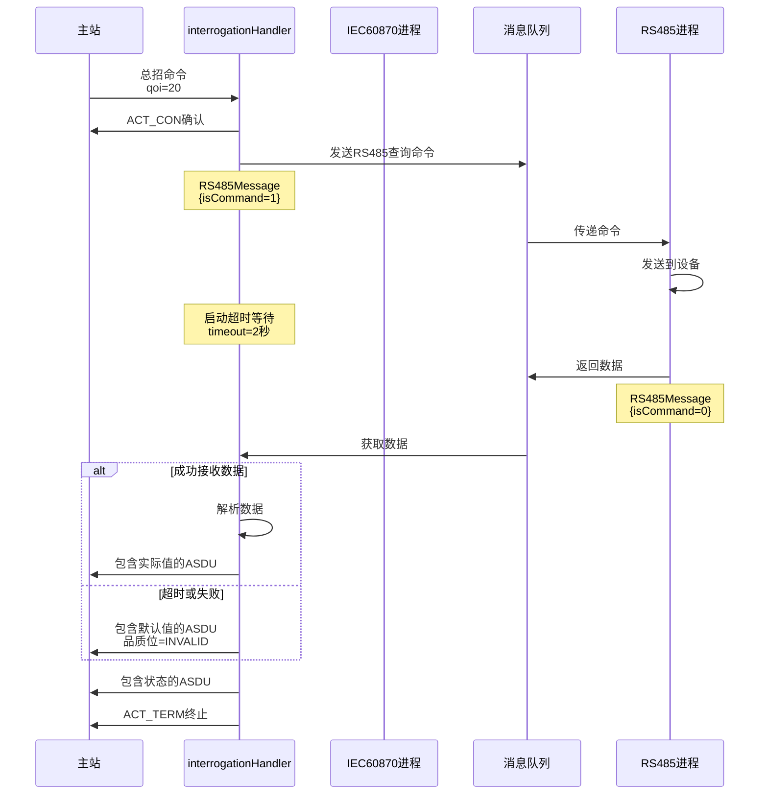

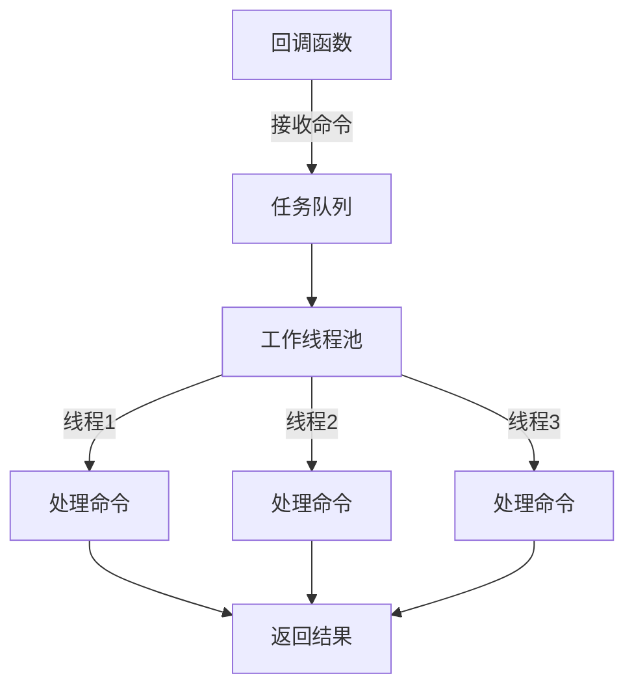


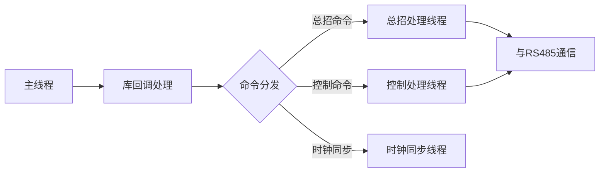

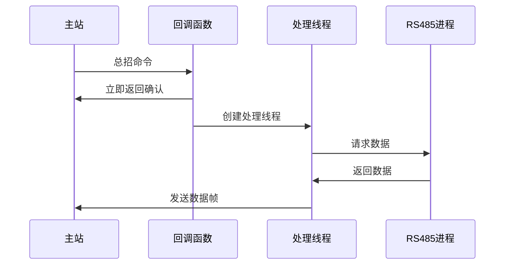

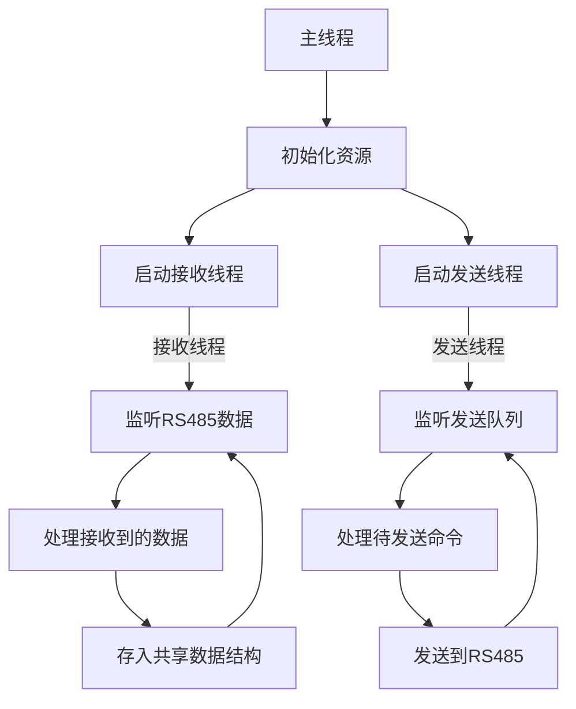


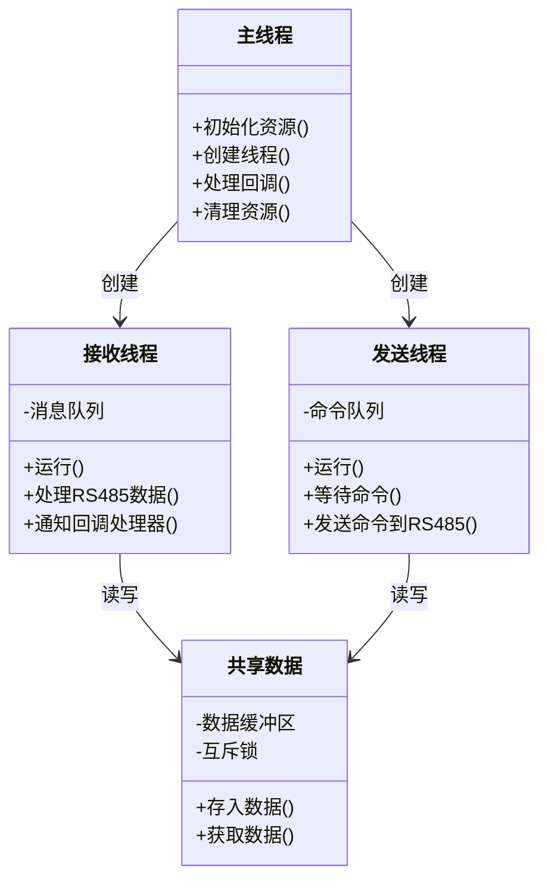


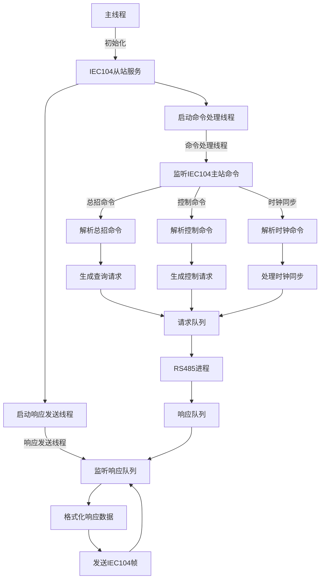


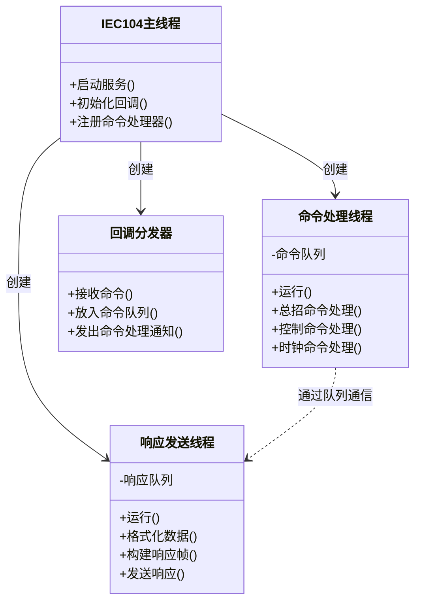
