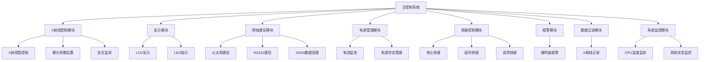
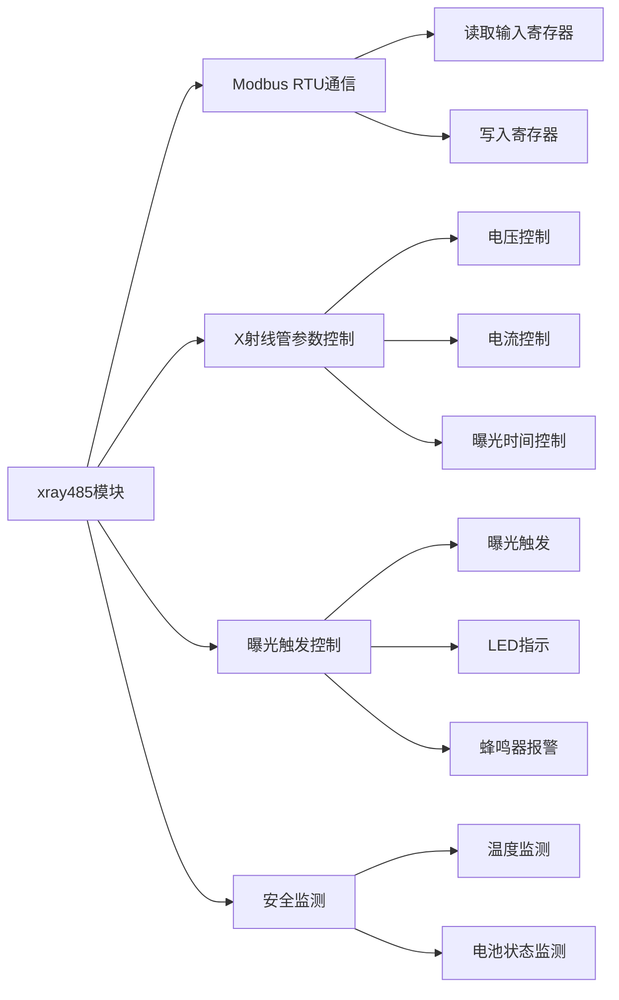
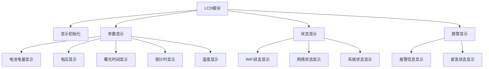
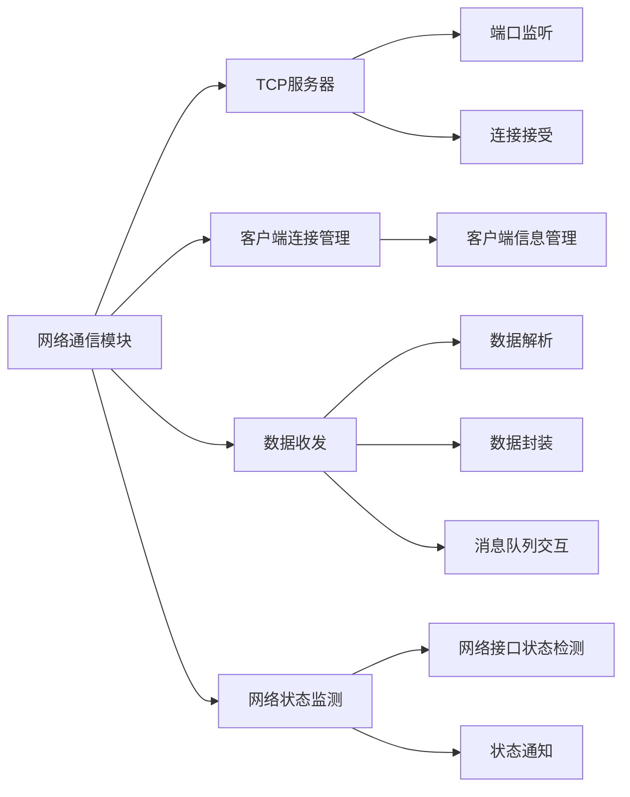
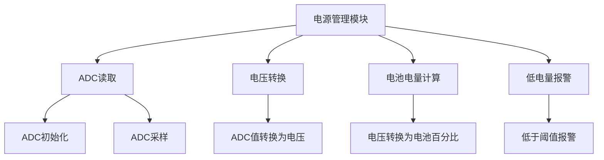
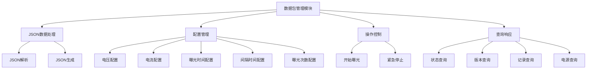
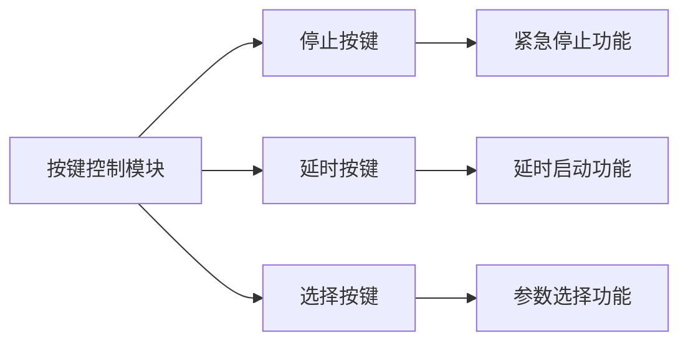
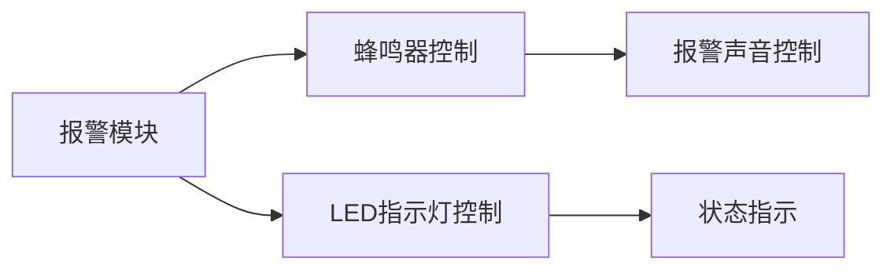
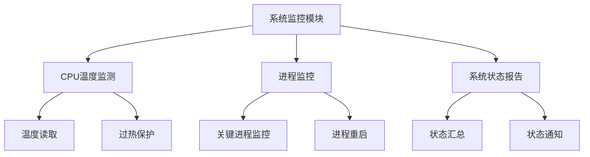
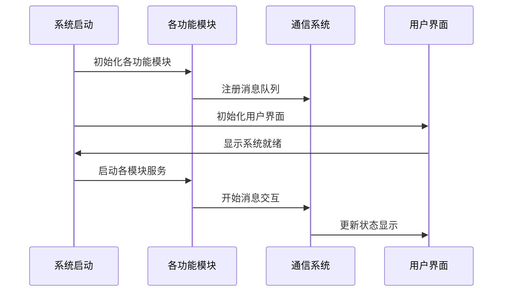

## 1. 项目概述

TQT113_linux_V2.0 是一个基于 Linux 的嵌入式系统项目，主要用于 X 射线设备的控制和监测。该项目运行在 T113 处理器平台上，采用模块化设计，通过消息队列实现各模块间的通信。

## 2. 系统架构



## 3. 核心功能模块

### 3.1 消息通信系统

项目采用消息队列机制实现各模块间的通信，核心定义在 `sc_msg_lib` 中：

| 模块 | 队列键值 | 功能描述 |
|------|---------|---------|
| XRAY_REC_QUEUE | 1352 | X射线接收队列 |
| RS232_REC_QUEUE | 1360 | RS232接收队列 |
| LCD_REC_QUEUE | 1368 | LCD接收队列 |
| ETH_REC_QUEUE | 1376 | 以太网接收队列 |
| RECORD_REC_QUEUE | 1384 | 记录接收队列 |
| BEEP_REC_QUEUE | 1392 | 蜂鸣器接收队列 |
| LED_REC_QUEUE | 1400 | LED接收队列 |
| POWER_REC_QUEUE | 1408 | 电源接收队列 |
| PACKMAN_REC_QUEUE | 1416 | 数据包管理接收队列 |
| STOP_KEY_REC_QUEUE | 1424 | 停止键接收队列 |
| DELAY_KEY_REC_QUEUE | 1432 | 延时键接收队列 |
| PACKMAN_JSON_QUEUE | 1440 | JSON数据包队列 |

### 3.2 X射线控制模块 (xray485)



- 通过 Modbus RTU 协议与 X 射线管通信
- 控制 X 射线管的电压、电流和曝光时间
- 监测 X 射线管温度和系统状态
- 支持的最大参数：
  - 最大电压：200.0V
  - 最大电流：2000.0mA
  - 最大温度：1000.0°C

### 3.3 显示模块 (lcd)



- 通过 UART 接口与 LCD 屏幕通信
- 显示系统参数：电池电量、电压、曝光时间、倒计时、温度等
- 显示系统状态：WiFi 连接状态、网络连接状态
- 显示报警信息和紧急状态

### 3.4 网络通信模块 (sc_eth)



- 实现 TCP 服务器功能，接受客户端连接
- 处理网络数据收发
- 解析和封装网络数据包
- 监测网络接口状态并通知系统

### 3.5 电源管理模块 (check_power)



- 通过 ADC 读取电池电压
- 计算电池剩余电量百分比
- 监测低电量状态并触发报警
- 低电量阈值：20%

### 3.6 数据包管理模块 (sc_packman)



- 处理 JSON 格式的数据包
- 管理系统配置参数
- 处理操作命令：开始曝光、紧急停止等
- 响应查询请求：状态、版本、记录、电源等

### 3.7 按键控制模块



- 停止按键：实现紧急停止功能
- 延时按键：实现延时启动功能
- 选择按键：实现参数选择功能

### 3.8 报警模块 (sc_beep)



- 控制蜂鸣器发出报警声音
- 控制 LED 指示灯显示系统状态

### 3.9 系统监控模块 (sc_monitor)



- 监测 CPU 温度
- 监控关键进程运行状态
- 汇总系统状态并通知相关模块

## 4. 通信协议

### 4.1 内部通信 - 消息队列

系统内部各模块通过消息队列进行通信，消息结构如下：

```
struct sc_msg {
    time_t msg_time;                 // 消息时间戳
    struct sc_msg_content msg_content_obj;  // 消息内容
};

struct sc_queue_msg {
    long int msg_type;               // 消息类型
    struct sc_msg sc_msg_obj;        // 消息对象
};
```

### 4.2 外部通信 - JSON

系统与外部设备通过 JSON 格式数据进行通信，主要支持以下类型：

- 配置命令 (cfg)：设置电压、电流、曝光时间等参数
- 操作命令 (opt)：控制系统操作，如开始曝光
- 紧急停止命令 (emg_stop)：紧急停止系统
- 查询命令 (query)：查询系统状态
- 时间设置 (time)：设置系统时间
- 版本查询 (version)：查询系统版本
- 记录查询 (record)：查询曝光记录
- 电源查询 (power)：查询电源状态

## 5. 安全机制

系统实现了多重安全保障机制：

1. **温度监测**：监测 X 射线管温度，防止过热
2. **电池监测**：监测电池电量，低电量时报警
3. **紧急停止**：提供紧急停止按钮，可立即停止系统
4. **参数限制**：对关键参数设置上下限，防止误操作
   - 电压范围：160V-200V
   - 电流范围：200mA-2000mA
   - 曝光时间范围：500ms-3000ms
   - 间隔时间范围：10ms-10000ms
   - 曝光次数范围：1-50次
   - 延时时间范围：0-60秒

## 6. 系统启动流程



## 7. 总结

TQT113_linux_V2.0 是一个功能完善的 X 射线设备控制系统，采用模块化设计，通过消息队列实现模块间通信。系统具有 X 射线控制、显示、网络通信、电源管理、按键控制、报警、数据记录和系统监控等功能，并实现了多重安全保障机制。

系统的主要特点包括：
1. 模块化设计，便于维护和扩展
2. 完善的通信机制，支持内部消息队列和外部 JSON 通信
3. 多重安全保障，确保系统安全可靠
4. 丰富的用户界面，提供直观的操作和状态显示
5. 完整的网络功能，支持远程控制和监测
