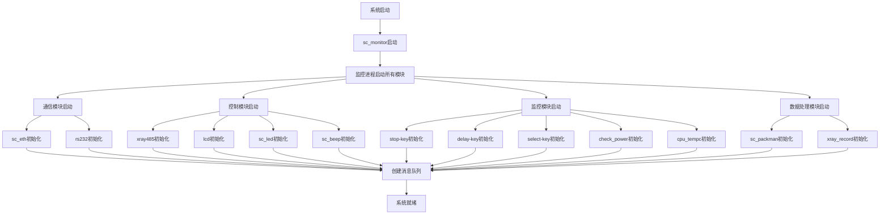

```mermaid
graph TD
    A[系统启动] --> B[sc_monitor启动]
    B --> C[监控进程启动所有模块]
    C --> D1[通信模块启动]
    C --> D2[控制模块启动]
    C --> D3[监控模块启动]
    C --> D4[数据处理模块启动]
    
    D1 --> E1[sc_eth初始化]
    D1 --> E2[rs232初始化]
    
    D2 --> F1[xray485初始化]
    D2 --> F2[lcd初始化]
    D2 --> F3[sc_led初始化]
    D2 --> F4[sc_beep初始化]
    
    D3 --> G1[stop-key初始化]
    D3 --> G2[delay-key初始化]
    D3 --> G3[select-key初始化]
    D3 --> G4[check_power初始化]
    D3 --> G5[cpu_tempc初始化]
    
    D4 --> H1[sc_packman初始化]
    D4 --> H2[xray_record初始化]
    
    E1 --> I[创建消息队列]
    E2 --> I
    F1 --> I
    F2 --> I
    F3 --> I
    F4 --> I
    G1 --> I
    G2 --> I
    G3 --> I
    G4 --> I
    G5 --> I
    H1 --> I
    H2 --> I
    
    I --> J[系统就绪]
```
