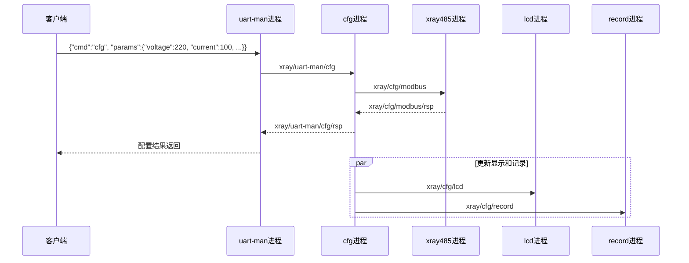
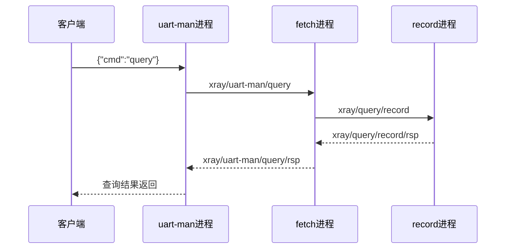
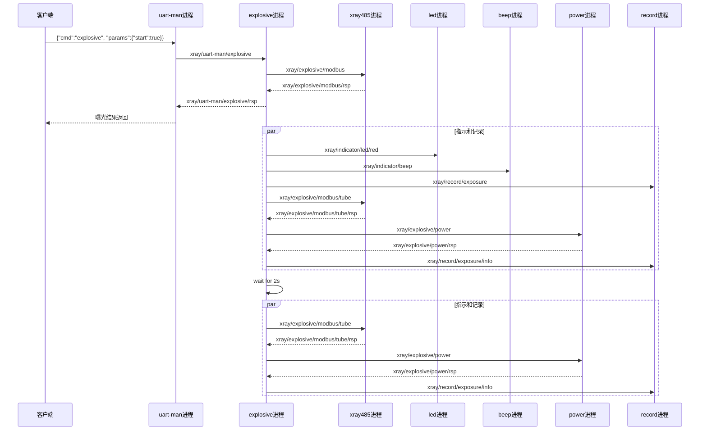
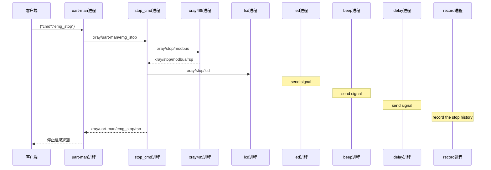
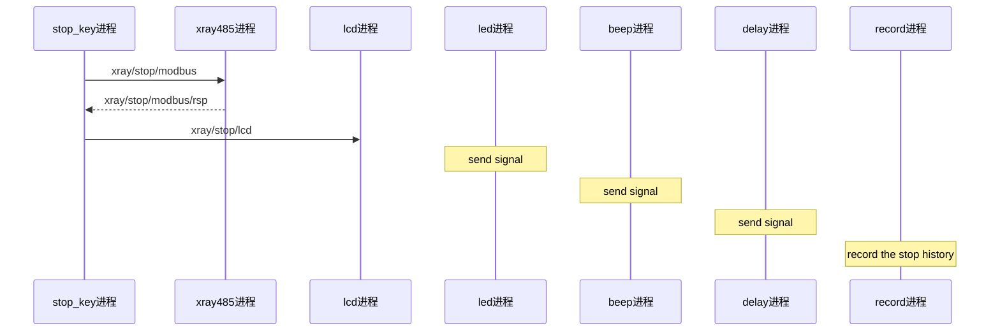
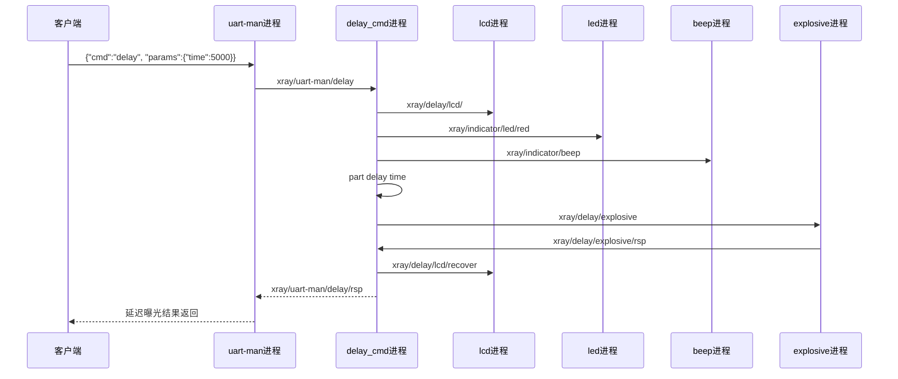
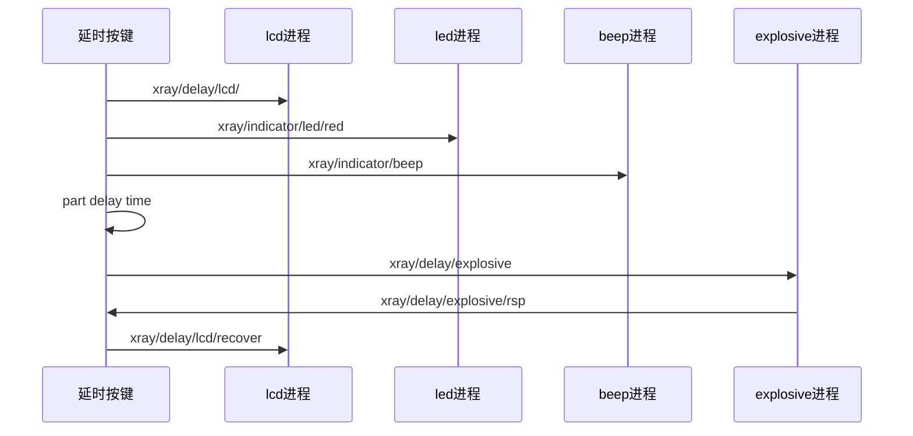
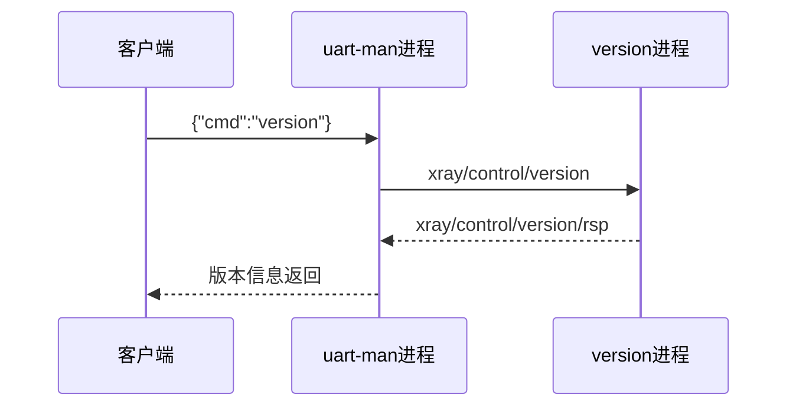
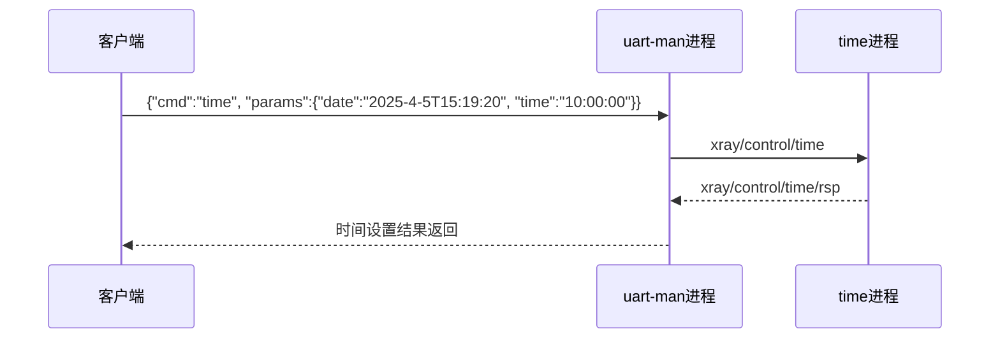
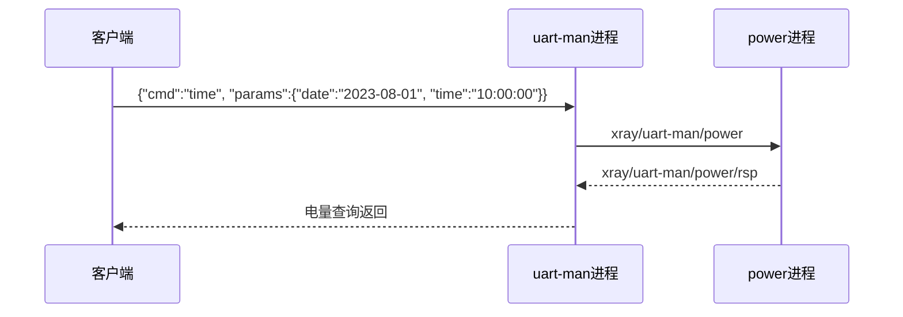

### 1. 配置参数命令 (cfg)-66

### 2. 查询参数命令 (query)-66

### 3. 曝光命令 (explosive)-66

### 4. 紧急停止命令 (stop_msg)--66

### 5. 紧急停止按键 (stop_key)--66

### 5. 延迟曝光命令 (delay-msg)--66

### 6. 延迟曝光按键 (delay-key)--66

### 7. 版本查询命令 (version)--66

### 8. 时间设置命令 (time)--66

### 9.  查询电池电量(power)--66

这样分开展示每个命令和模块的时序图，可以更清晰地看到：
1. 每个命令的具体执行流程
2. 各个模块之间的交互关系
3. 数据流向和响应机制
4. 实时显示和记录的处理方式
5. 系统监控的持续运行机制

每个模块都通过MQTT主题进行通信，保证了系统的模块化和可维护性。
