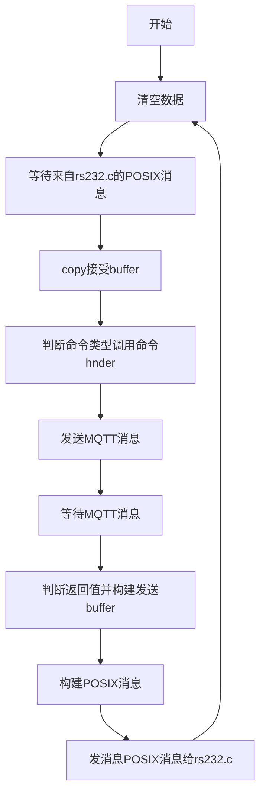
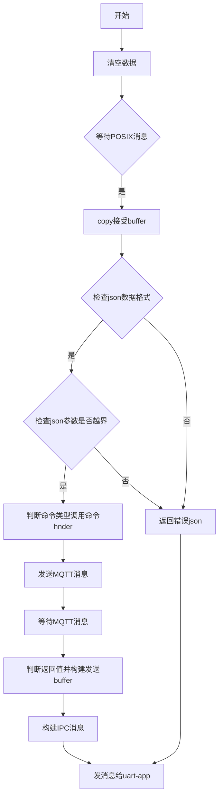

#### 需要调用cjson库

#### 接受buffer
uint8_t rx_data[RS232_BUFFER_SIZE]; 

#### 发送buffer
uint8_t tx_data[RS232_BUFFER_SIZE]; 

#### 使用POSIX 消息队列和串口进程通信，串口发过来是的cjosn数据
typedef struct {

    uint8_t data[RS232_BUFFER_SIZE]; /**< 数据缓冲区 */

    size_t length;                   /**< 数据长度 */

} uart_data_t;

 data[RS232_BUFFER_SIZE] 为以下内容：
`{"cfg":{"vol_kV":180,"cur_uA":1000,"time_ms":1200,"gap_s":100,"num":30}}`

#### 使用MQTT pacho 库
不使用回调函数
使用MQTTClient_receive
发送的数据为：
{
  "cmd": "cfg",
  "params": {
    "voltage": 200.0,     // 电压值，范围160.0-200.0V
    "current": 2000.0,    // 电流值，范围200.0-2000.0mA
    "exposure_time": 1000, // 曝光时间，范围500-3000ms
    "interval_time": 500,  // 曝光间隔时间，范围10-10000ms
    "number": 1           // 曝光次数，范围1-50
  },
  "timestamp": "2025-03-17T10:30:00" // ISO 8601格式时间戳
}

********************************************

