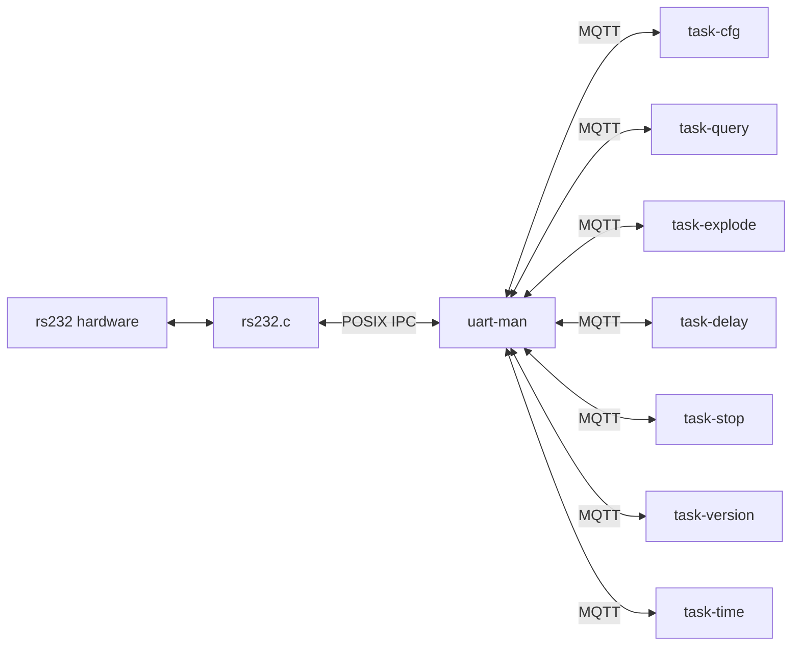
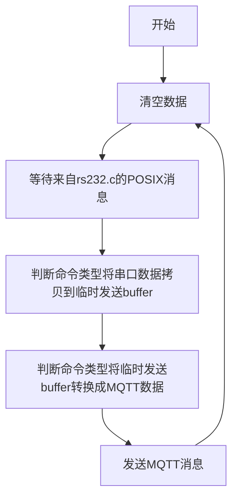
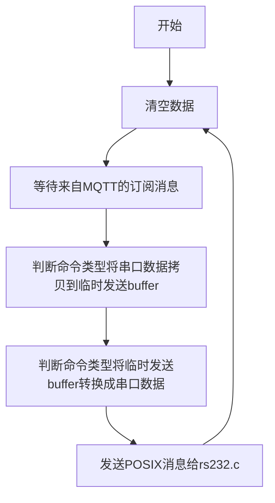

###  1 系统结构



### 2 uart-man
#### uart-man包含2个线程
(1) rs232_to_mqtt_thread
(2) mqtt_to_rs232_thread

###  3 rs232_to_mqtt_thread



### 4 mqtt_to_rs232_thread




### 4 串口命令

串口进程使用POSIX 消息队列，串口消息是cjosn数据，需要调用cjson库
#### 4.1 串口接受命令
```bash
{"cfg":{"vol_kV":180,"cur_uA":1000,"time_ms":1200,"gap_s":100,"num":30}}
{"opt":{"start_exp":1,"cd_s":0}} 
{"emg_stop":1} 
{"query":1} 
{"time": "2024-12-27T15:30:25"} 
{"version":1}
{"record":1}
```
#### 4.2 返回串口命令
```bash
{"cfg":1}
{"opt":{"start_exp":1,"cd_s":0}} 
{"emg_stop":1} 
{"query":{"vol_kV":180,"cur_uA":1000,"time_ms":1200,"gap_s":100,"num":30}} 
{"time": 1} 
{"version": R1A01}
{"power":25}
```

#### 4.3 串口数据类型
```bash
typedef struct {
    uint8_t data[RS232_BUFFER_SIZE]; /**< 数据缓冲区 */
    size_t length;                   /**< 数据长度 */
} uart_data_t;

```

### 5 使用MQTT pacho 库
相对回调函数，推荐使用MQTTClient_receive

### 6 以时间更新为例


#### 6.1 串口接受命令

```bash
{"time": "2024-12-27T15:30:25"} 
```

#### 6.2 返回串口命令

```bash
{"time": 1} 
```

#### 6.3 time MQTT 主题

**主题**: `xray/uart-man/time`
**请求格式**:
```json
{
  "cmd": "time",
  "settime": "2025-03-17T10:35:00"  // ISO 8601格式时间
  "timestamp": "2025-03-17T10:35:00"
}
```

**主题**: `xray/uart-man/time/rsp`

**响应格式**:
```json
{
  "cmd": "time",
  "current_time": "2025-03-17T10:35:01",
  "timestamp": "2025-03-17T10:35:01"
}
```


