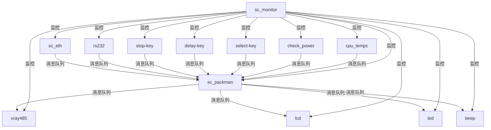
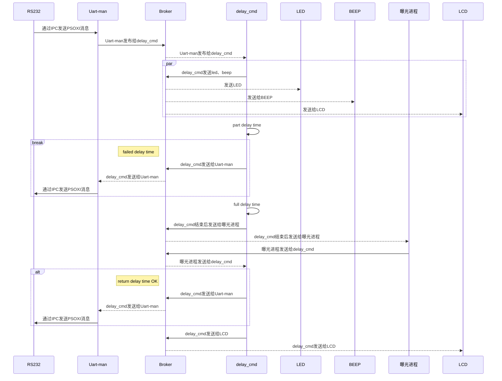
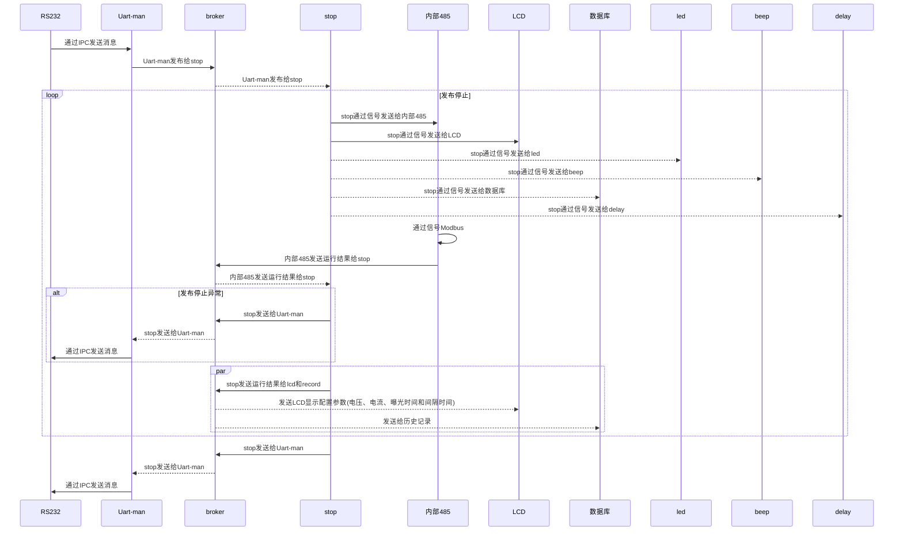

# 一、当前功能梳理  

| 编号  | 功能模块名称               | 功能描述                                                                                                                                                                                                                                                                                                              | 备注  |
| --- | -------------------- | ----------------------------------------------------------------------------------------------------------------------------------------------------------------------------------------------------------------------------------------------------------------------------------------------------------------- | --- |
| 1   | X射线控制模块 (xray485)    | 1. 通过 Modbus RTU 协议与 X 射线管通信 2. 控制 X 射线管的电压、电流和曝光时间 3. 支持的最大参数：最大电压 200.0V，最大电流 2000.0mA                                                                                                                                                                                                                    | -   |
| 2   | 液晶模块 (lcd)           | 1. 显示系统参数：     a. 曝光电压     b. 曝光时间     c. 曝光倒计时     d. 曝光紧急停止状态 2. 显示系统状态：     a. WiFi 连接状态     b. 网络连接状态     c. 电池电量 3. 倒计时功能：     a. 显示曝光倒计时总时间     b. 曝光结束后清零倒计时时间     c. 在延迟曝光过程中，如果接收到曝光停止消息将倒计时时间清零 4. 紧急停止显示：     a. 收到曝光紧急停止消息后显示为 “yes”     b. 曝光结束后显示为“no” | -   |
| 3   | 网络通信模块 (sc_eth)      | 1. 实现 TCP 服务器功能 2. 接受客户端连接 3. 处理网络数据收发                                                                                                                                                                                                                                                                      | -   |
| 4   | 电池管理模块 (check_power) | 1. 实时监测低电量状态     a. 低电量阈值：20%     b. 触发 LED 绿灯闪烁 2. 电量变化时将电量百分比发送给 LCD 3. 每 4 分钟发给数据库记录一次电池电量                                                                                                                                                                                                         | -   |
| 5   | CPU 温度检测模块           | 1. 每 3 分钟将 CPU 温度发送给数据库                                                                                                                                                                                                                                                                                           | -   |
| 6   | 延迟曝光模块               | 1. 延迟曝光消息处理线程 2. 延迟曝光按键处理线程 3. 延迟曝光过程中：     a. 发消息给 beep（500ms 蜂鸣一次）     b. lcd（显示曝光倒计时时间）     c. LED 红灯（闪烁） 4. 延迟结束：     a. 发送消息给射线管开始曝光     b. 发消息给 beep 蜂鸣 2s     c. 发消息给 lcd（清除曝光倒计时时间）     d. 发消息给红色 LED（亮 2 秒）                                                                | -   |
| 7   | LED 灯模块              | 1. 红灯：     a. 延迟曝光时闪烁     b. 曝光时亮 2 秒 2. 绿灯：     a. 电量过低时绿灯亮                                                                                                                                                                                                                                          | -   |
| 8   | 网络串口通信模块 (sc_232)    | 1. 处理串口数据收发                                                                                                                                                                                                                                                                                                       | -   |
| 9   | beep 模块 (sc_beep)    | 1. 延迟曝光过程中 500ms 蜂鸣一次 2. 曝光时蜂鸣 2 秒                                                                                                                                                                                                                                                                             | -   |
| 10  | 选择按键模块 (sc_select)   | 1. 按键一次配置电压 200kV、电流 2000mA 2. 再按键一次配置电压 100kV、电流 1000mA                                                                                                                                                                                                                                                       | -   |
| 11  | 紧急中断模块 (sc_stop)     | 1. 紧急停止消息处理线程 2. 紧急停止按键处理线程 3. 紧急停止过程：     a. 中止并重启延迟，beep 和 led     b. 发消息给射线管中止曝光     c. 发消息给 lcd 紧急停止显示为“yes”                                                                                                                                                                                   | -   |
| 12  | 历史记录模块 (sc_record)   | 1. 记录 CPU 的温度数据 2. 记录电池电量数据 3. 记录配置射线机参数 4. 使用 query 获取射线机配置参数 5. 记录曝光前后的参数 6. 上电恢复射线机配置参数                                                                                                                                                                                                         |     |
| 13  | packman的json数据处理     | 1. 处理 JSON 格式的数据包 2. 处理操作命令：     a. cfg--配置射线机参数     b. query--获取射线机参数     c. opt--立即曝光和延迟曝光     d. emg_stop--紧急停止     e. version--查看版本     f. time--更新时间 	g. power--查看电池电量                                                                                                               |     |

# 二、当前架构

X 射线设备的控制和管理系统是基于 Linux 的嵌入式系统项目 。
采用模块化设计，由多个独立进程组成，每个进程负责特定的功能，通过消息队列实现进程间通信。

### 1. 当前框架

### 2. ==需要优化的点==

### ==(1) 进程间通信机制--解耦==
a. **紧耦合的消息队列机制**：当前系统使用Linux原生消息队列(IPC)进行模块间通信，这种方式在单机环境下工作良好，但缺乏扩展性和灵活性
b. **消息可靠性保障不足**：原生消息队列在系统崩溃时可能丢失消息

### ==(2) 简化代码逻辑--解耦==
a. **消除packman消息嵌套**：packman进程内消息通讯机制嵌套
b. **简化XRAY485功能**：XRAY485进程不仅处理modubus模块，还处理系统功能逻辑

# 三、备选消息中间件 

### 1. 使用中间件的背景

#### (1) 当前消息模型

![[640px-Processes_without_D-Bus.svg_.png]]

#### (2) 消息中间件模型

![[640px-Processes_with_D-Bus.svg_.png]]

以下是消息中间件与非消息中间件（如直接调用、同步通信等）的对比

| 对比维度     | 消息中间件                        | 非消息中间件（直接调用/同步通信）              |
| -------- | ---------------------------- | ------------------------------ |
| **耦合度**  | 解耦合，发送方和接收方无需直接依赖对方，可独立开发和部署 | 紧耦合，发送方需要知道接收方的接口和地址，依赖性强      |
| **通信模式** | 异步通信，发送方发送消息后立即返回，不等待响应      | 同步通信，发送方需等待接收方处理完成并返回结果        |
| **可靠性**  | 支持消息持久化、故障转移和重试机制，可靠性高       | 依赖于网络和系统稳定性，容易因网络问题或系统故障导致调用失败 |
| **可扩展性** | 支持水平扩展，通过增加节点可轻松应对消息量增长      | 扩展性较差，需对现有系统进行大规模修改            |

### 2. 各个中间件（DBus/MQTT/RabbitMQ）对比

| 依据          | DBus                    | MQTT              | RabbitMQ               | 备注  |
| ----------- | ----------------------- | ----------------- | ---------------------- | --- |
| ==应用规模==    | 适用于桌面应用和本地系统服务          | 适用于物联网和轻量级应用      | 适用于大规模企业级应用和云计算环境      |     |
| ==技术成熟度==   | 成熟，广泛应用于 Linux 系统       | 成熟，广泛应用于物联网和工业领域  | 成熟，广泛应用于企业级消息队列        |     |
| ==学习曲线==    | 陡峭，需要理解系统级交互            | 平缓，适合快速上手         | 陡峭，需要理解系统级交互           |     |
| ==移植开发工作量== | 主要用于 Linux，移植到其他平台工作量较大 | 轻量级，易于移植到多种平台     | 企业级应用，移植工作量较大，但有丰富文档支持 |     |
| ==UI显示支持==  | 主要用于后台通信，对UI显示支持有限      | 可通过客户端集成展示数据，但非强项 | 可通过管理界面和客户端集成展示数据      |     |
| 低功耗处理       | 无特殊低功耗设计                | 面向物联网，适合低功耗设备     | 无特殊低功耗设计，适合服务器环境       |     |
| 效率          | 适合本地进程间通信，效率高           | 面向物联网，轻量级，效率较高    | 面向企业级消息队列，效率高，但依赖网络延迟  |     |
| 接口支持        | 主要支持 Linux 系统，接口丰富      | 支持多种语言和平台，有广泛客户端库 | 支持多种语言和平台，有广泛客户端库      |     |
| 硬件支持        | 主要用于桌面和服务器环境，对硬件要求较低    | 适合嵌入式设备和低功耗硬件     | 适合服务器和云计算环境，对硬件要求较高    |     |
| 安全测试        | 提供基本的安全机制，如认证和加密        | 提供传输层安全（TLS）等安全机制 | 提供多种安全机制，如认证、授权和加密     |     |

### 5. ==选择结论==

在对比 D-Bus、MQTT 和 RabbitMQ 时，新的平台选择**MQTT** ，原因如下：
- **功能强大且高效**，特别适合物联网和嵌入式设备。
- **广泛支持多种语言和平台**，适合不同开发场景。
- **学习曲线平缓**，适合快速入门和开发轻量级应用。

# 四、新架构

### 1. 新架构

![[系统架构.png]]

### 2. 升级新框架的优势，解决的问题  

#### ==（1）框架性能提升--50%

| 特性           | System V消息队列    | MQTT         |
| ------------ | --------------- | ------------ |
| **移植开发工作量**  | 低（已实现）          | 中            |
| **技术成熟度**    | 高（系统原生）         | 高（广泛应用）      |
| **学习使用的性价比** | 中（API简单但缺乏高级特性） | 高（概念简单，文档丰富） |
| **效率**       | 高（本地通信）         | 中（需要Broker）  |
| **接口支持**     | 低（C语言API）       | 高（多语言支持）     |
| **硬件支持**     | 高（低资源占用）        | 中（需要额外资源）    |
| **UI显示支持**   | 无（需自行实现）        | 间接支持（通过消息）   |
| **低功耗处理**    | 高（低开销）          | 中（需要保持连接）    |
| **应用规模**     | 小型（单机）          | 大型（分布式）      |
| **安全性**      | 低（基本权限控制）       | 中（支持TLS和认证）  |
|              |                 |              |

##### 1. **解耦模块依赖**：通过发布/订阅模式降低模块间耦合
##### 2. **提高系统可靠性**：利用MQTT的QoS机制确保消息可靠传递
##### 3. **增强扩展性**：轻松添加新模块和功能

#### ==(2)  代码的逻辑功能--50%

##### 1. **当前方案**：
##### a) xray485包含蓝色的业务逻辑
##### b) packman包含4个业务handler（cfg、query、opt和stop）

![[Pasted image 20250313150332.png]]
##### 2. **新方案**：
##### a) xray485仅包含modbus模块功能
##### b) 取消packman模块，其之前包含4个业务handler成5个独立的进程（cfg、query、explosive、stop和delay），避免消息嵌套

![[Pasted image 20250313150348.png]]

# 五、新架构主要进程功能的时序图  

针对新的建构，完成了6个进程的时序图：
cfg、fetch、delay_cmd、delay_key、stop_cmd和stop_key

**以下仅展示delay_cmd、stop_cmd时序图**
### 1. delay命令 

### 2. stop命令

# 六、测试验证方案  

### 1. 测试内容
##### 1.1 MQTT客户端库测试
##### 1.2 模块功能测试
##### 1.3 长时间运行测试

### 2. 测试GUI
##### 2.1 选择C#作为开发语言，创建测试GUI
##### 2.2 GUI的设计
针对cfg、fetch、delay_cmd、stop_cmd命令进行单独的功能测试
包含按钮和进度条：
按钮：用于触发测试事件
进度条： 用于显示功能测试过程和结果

### 3. 自动化测试方案

##### 3.1 环境准备
- 完成Jenkins和GitLab服务部署，并且两者网络可以相互访问。
- 在Jenkins中安装必要的插件，如Git插件、GitLab插件
##### 3.2  Jenkins任务配置
##### 3.3 GitLab配置
##### 3.4  测试流程
- 人工烧写image
- 触发Jenkins任务
- 调用GUI测试工具
- 生成测试报告

![[Pasted image 20250313161532.png]]

# 七、结论

项目从System V消息队列架构升级到现代化的通信架构（MQTT）将带来显著的好处：

1. **模块解耦**：各功能模块通过主题订阅/发布机制实现松耦合，提高系统可维护性
2. **可靠通信**：利用MQTT的QoS机制确保关键消息可靠传递
3. **扩展能力**：支持系统功能扩展和规模扩展，适应未来需求
4. **运维便利**：丰富的监控和调试工具，提高系统可维护性