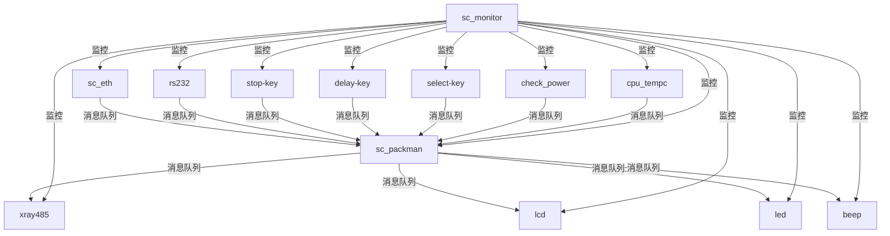
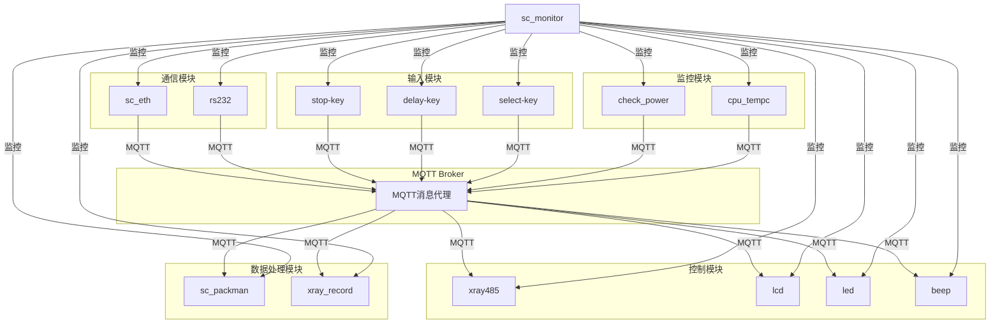
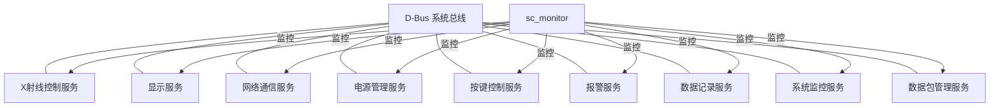
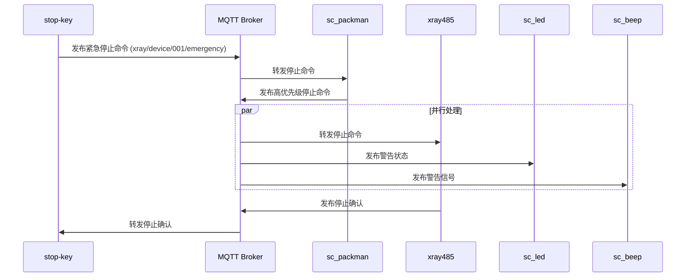
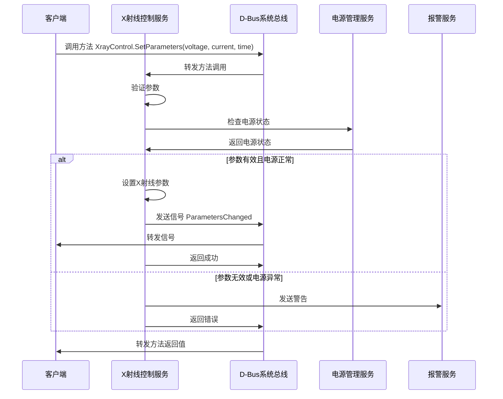
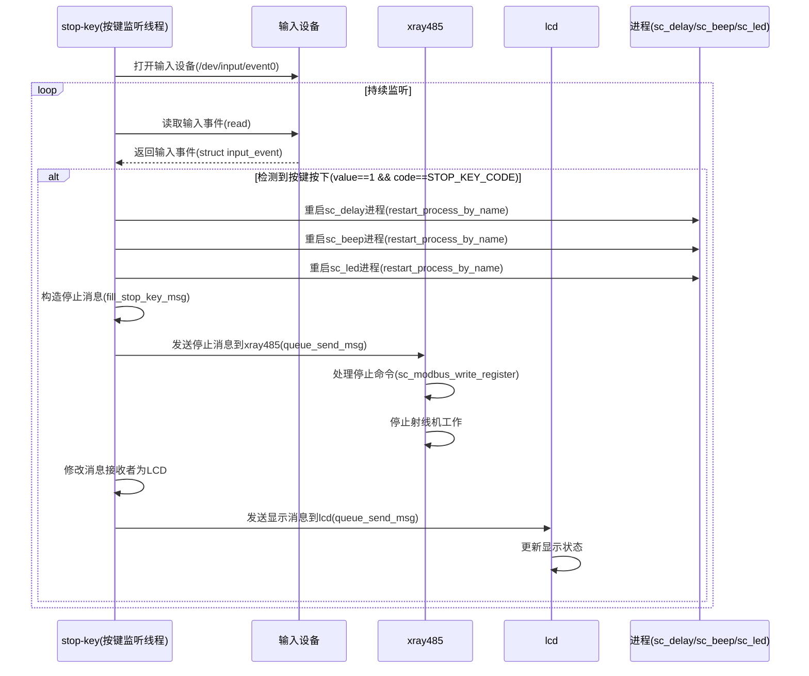

## 目录

1. [当前功能梳理](#1-当前功能梳理)
2. [新老架构图](#2-新老架构图)
3. [消息中间件特性比较](#3-消息中间件特性比较)
4. [升级新框架的优势](#4-升级新框架的优势)
5. [主要进程功能的时序图](#5-主要进程功能的时序图)
6. [测试验证方案](#6-测试验证方案)
7. [结论](#7-结论)

## 1. 当前功能梳理

TQT113_linux_V2.0 是一个基于 Linux 的嵌入式系统项目，主要用于 X 射线设备的控制和管理。该系统采用模块化设计，由多个独立进程组成，每个进程负责特定的功能，通过消息队列实现进程间通信。

### 1.1 核心模块功能

| 模块名称 | 功能描述 |
|---------|---------|
| **sc_monitor** | 系统监控和进程管理，监控所有关键进程的运行状态，自动重启异常进程 |
| **sc_eth** | 网络通信服务器，处理TCP连接和JSON格式数据交换 |
| **sc_packman** | 数据包管理，处理JSON命令和响应 |
| **xray485** | X射线控制，通过Modbus RTU协议控制X射线管 |
| **sc_lcd** | LCD显示控制，更新用户界面 |
| **sc_led** | LED指示灯控制 |
| **sc_beep** | 蜂鸣器控制，提供声音提示 |
| **stop-key** | 紧急停止按键处理 |
| **delay-key** | 延时按键处理 |
| **select-key** | 选择按键处理 |
| **check_power** | 电源监控 |
| **cpu_tempc** | CPU温度监控 |
| **xray_record** | X射线记录功能，记录操作历史 |
| **rs232** | 串口通信 |

### 1.2 系统特点

1. **模块化设计**：系统被分解为多个独立进程，每个进程负责特定功能
2. **进程间通信**：使用System V消息队列实现进程间通信
3. **监控机制**：通过sc_monitor进程实现对其他进程的监控和管理
4. **硬件抽象**：硬件操作被封装在专门的进程中
5. **安全机制**：实现了多重安全保护，如温度监控、电源监控和紧急停止
6. **网络连接**：支持网络通信，可以通过网络远程控制和监控系统
7. **数据记录**：记录系统运行数据，支持历史查询和分析

## 2. 新老架构图

### 2.1 当前架构（System V消息队列）

### 2.2 MQTT架构

### 2.3 D-Bus架构

## 3. 消息中间件特性比较

### 3.1 比较表

| 特性           | System V消息队列    | MQTT         | D-Bus/dbus-broker |
| ------------ | --------------- | ------------ | ----------------- |
| **移植开发工作量**  | 低（已实现）          | 中            | 高                 |
| **技术成熟度**    | 高（系统原生）         | 高（广泛应用）      | 高（Linux标准）        |
| **学习使用的性价比** | 中（API简单但缺乏高级特性） | 高（概念简单，文档丰富） | 中（概念复杂但功能强大）      |
| **效率**       | 高（本地通信）         | 中（需要Broker）  | 高（优化的本地通信）        |
| **接口支持**     | 低（C语言API）       | 高（多语言支持）     | 高（多语言绑定）          |
| **硬件支持**     | 高（低资源占用）        | 中（需要额外资源）    | 中（需要额外资源）         |
| **UI显示支持**   | 无（需自行实现）        | 间接支持（通过消息）   | 直接支持（与桌面环境集成）     |
| **低功耗处理**    | 高（低开销）          | 中（需要保持连接）    | 中（按需激活）           |
| **应用规模**     | 小型（单机）          | 大型（分布式）      | 中型（系统级）           |
| **安全性**      | 低（基本权限控制）       | 中（支持TLS和认证）  | 高（细粒度权限控制）        |

### 3.2 详细分析

#### 3.2.1 移植开发工作量

- **System V消息队列**：当前系统已实现，无需额外工作
- **MQTT**：
  - 需要部署MQTT Broker（如Mosquitto）
  - 开发MQTT客户端库
  - 改造现有模块以支持MQTT通信
  - 工作量估计：中等（约2周）
- **D-Bus**：
  - 需要学习D-Bus概念和API
  - 定义服务、接口和方法
  - 改造现有模块以支持D-Bus通信
  - 配置权限和安全策略
  - 工作量估计：较高（约3-4周）

#### 3.2.2 技术成熟度

- **System V消息队列**：Linux系统原生支持，技术成熟稳定
- **MQTT**：
  - 广泛应用于物联网和分布式系统
  - 有多种成熟的实现（Mosquitto、EMQ等）
  - 标准化协议（OASIS标准）
- **D-Bus**：
  - Linux桌面环境的标准IPC机制
  - 广泛应用于系统服务通信
  - dbus-broker是更现代化的高性能实现

#### 3.2.3 学习使用的性价比

- **System V消息队列**：
  - API简单，易于学习
  - 缺乏高级特性（如消息路由、QoS）
  - 文档相对有限
- **MQTT**：
  - 概念简单（发布/订阅模型）
  - API直观（连接、订阅、发布、接收）
  - 丰富的文档和示例
  - 多种可视化工具（如MQTT Explorer）
- **D-Bus**：
  - 概念较复杂（服务、对象、接口、方法、信号、属性）
  - 需要学习XML接口定义
  - 需要了解权限模型
  - 调试工具相对复杂（d-feet、dbus-monitor）

## 4. 升级新框架的优势

### 4.1 MQTT架构优势

1. **解耦性**：
   - 发布/订阅模式使模块间完全解耦
   - 模块只需关注自己感兴趣的主题
   - 新增模块无需修改现有代码

2. **扩展性**：
   - 易于添加新设备和功能
   - 支持集群部署
   - 可扩展到分布式系统

3. **标准化**：
   - 使用标准MQTT协议
   - 丰富的客户端库和工具
   - 生态系统完善

4. **网络通信能力**：
   - 支持多种网络环境
   - 断线重连机制
   - 低带宽占用
   - 支持大量并发连接

5. **消息可靠性**：
   - 支持三种QoS级别
   - 支持消息保留机制
   - 支持遗嘱消息机制

6. **运维便利性**：
   - 可视化监控工具
   - 日志追踪能力
   - 简单的配置和部署

### 4.2 D-Bus架构优势

1. **系统集成度**：
   - 与Linux系统深度集成
   - 与systemd等系统服务协同工作
   - 标准化的系统接口

2. **性能**：
   - 低延迟通信
   - 优化的消息传递
   - dbus-broker提供更高性能

3. **类型安全**：
   - 强类型接口定义
   - 编译时类型检查
   - 减少运行时错误

4. **安全性**：
   - 细粒度的访问控制
   - 基于策略的权限管理
   - 与系统安全机制集成

5. **资源控制**：
   - 与cgroup集成
   - 精细的资源限制
   - 进程隔离

### 4.3 解决的问题

1. **紧耦合问题**：
   - 当前架构中模块间直接通过队列ID通信，耦合度高
   - 新架构通过主题/接口抽象，降低耦合度

2. **扩展性问题**：
   - 当前架构增加新模块需要修改多处代码
   - 新架构只需订阅/发布相关主题或实现相关接口

3. **可靠性问题**：
   - 当前架构缺乏消息确认机制
   - 新架构提供QoS保证和错误处理

4. **监控能力**：
   - 当前架构只能监控进程是否存在
   - 新架构可以监控消息流和系统状态

5. **远程访问**：
   - 当前架构主要支持本地通信
   - 新架构（特别是MQTT）天然支持远程通信

6. **配置管理**：
   - 当前架构配置变更需要重新编译
   - 新架构支持动态配置更新

## 5. 主要进程功能的时序图

### 5.1 紧急停止功能时序图（MQTT架构）

### 5.2 X射线控制时序图（D-Bus架构）

### 5.3 按键监听线程时序图（当前架构）

## 6. 测试验证方案

### 6.1 单元测试

1. **模块功能测试**：
   - 为每个改造的模块编写单元测试
   - 验证基本功能（发布/订阅或方法调用）
   - 验证错误处理机制

2. **接口测试**：
   - 测试消息格式和接口定义
   - 验证类型安全性
   - 测试边界条件

3. **性能测试**：
   - 测量消息延迟
   - 测量资源占用（CPU、内存）
   - 测试高负载情况

### 6.2 集成测试

1. **系统功能测试**：
   - 验证所有模块协同工作
   - 测试关键业务流程
   - 验证系统行为与预期一致

2. **故障注入测试**：
   - 模拟进程崩溃
   - 模拟网络断开
   - 模拟资源耗尽
   - 验证系统恢复能力

3. **长时间运行测试**：
   - 系统连续运行测试（24小时以上）
   - 监控资源使用趋势
   - 检查内存泄漏和资源耗尽

### 6.3 安全测试

1. **权限测试**：
   - 验证访问控制策略
   - 测试未授权访问
   - 验证权限隔离

2. **通信安全测试**：
   - 测试TLS加密（MQTT）
   - 测试认证机制
   - 测试消息完整性

### 6.4 测试工具

1. **MQTT测试工具**：
   - MQTT Explorer：可视化监控和调试
   - Mosquitto客户端工具：命令行测试
   - MQTT.fx：功能测试和模拟

2. **D-Bus测试工具**：
   - d-feet：D-Bus接口浏览和调试
   - dbus-monitor：监控D-Bus消息
   - dbus-send：发送测试消息

3. **通用测试工具**：
   - Valgrind：内存泄漏检测
   - strace：系统调用跟踪
   - perf：性能分析

### 6.5 测试验证流程

1. **准备阶段**：
   - 搭建测试环境
   - 编写测试用例
   - 准备测试数据

2. **执行阶段**：
   - 执行单元测试
   - 执行集成测试
   - 执行性能测试
   - 执行安全测试

3. **分析阶段**：
   - 收集测试结果
   - 分析性能数据
   - 识别潜在问题

4. **修复阶段**：
   - 修复发现的问题
   - 重新测试验证
   - 更新文档和代码

## 7. 结论

### 7.1 架构选择建议

基于对TQT113_linux_V2.0项目的分析和各种消息中间件的比较，我们提出以下建议：

1. **主要推荐：D-Bus（特别是dbus-broker实现）**
   - 理由：
     - 与Linux系统深度集成
     - 提供低延迟和高性能
     - 支持类型安全的接口
     - 提供细粒度的安全控制
     - 适合嵌入式系统的实时控制需求

2. **替代方案：MQTT**
   - 适用场景：
     - 如果需要更强的分布式能力
     - 如果需要远程监控和控制
     - 如果团队对MQTT更熟悉

3. **混合架构**：
   - 对于关键控制功能，使用D-Bus
   - 对于非实时通信和远程监控，使用MQTT
   - 通过网关连接两种架构

### 7.2 实施建议

1. **分阶段实施**：
   - 第一阶段：基础设施搭建
   - 第二阶段：核心模块改造
   - 第三阶段：全面推广
   - 第四阶段：优化和完善

2. **降低学习成本**：
   - 开发简化的工具库
   - 提供标准模板和示例
   - 编写详细的使用指南

3. **保留兼容性**：
   - 设计适配层，支持新旧架构共存
   - 逐步迁移，确保系统稳定

### 7.3 最终结论

TQT113_linux_V2.0项目从System V消息队列架构升级到现代化的通信架构（D-Bus或MQTT）将带来显著的好处：

1. **提高系统可靠性**：通过更强大的错误处理和消息确认机制
2. **增强系统可维护性**：通过降低模块间耦合和标准化接口
3. **提升系统扩展性**：通过灵活的通信模式和模块化设计
4. **改进系统安全性**：通过细粒度的权限控制和加密通信
5. **增强监控能力**：通过全面的系统状态监控和消息跟踪

通过合理选择通信架构并精心设计实施计划，可以在保持系统稳定性的同时，实现架构的平稳升级，为系统带来长期的技术优势和业务价值。
