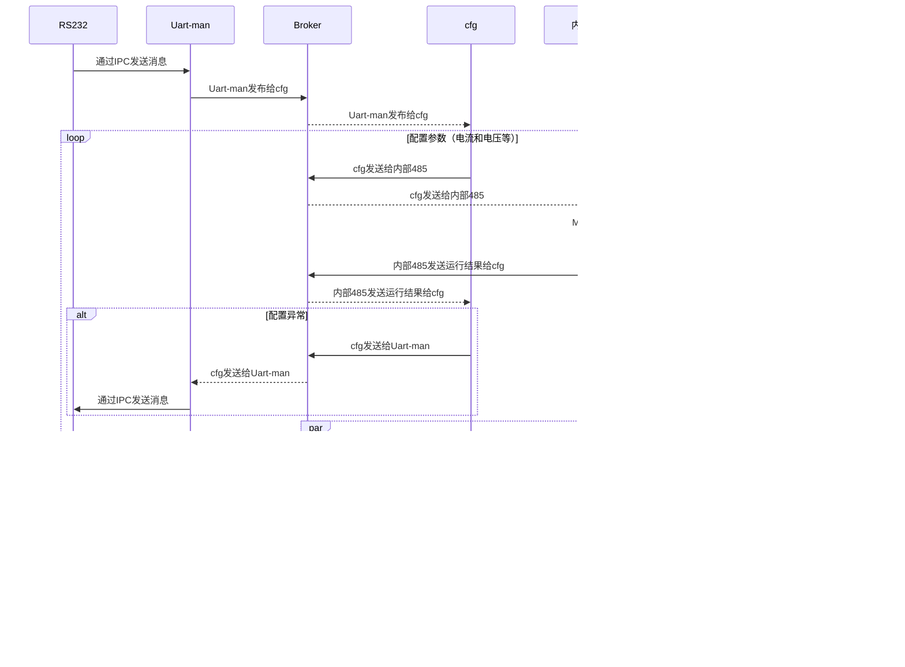

```mermaid  
sequenceDiagram  
participant A as RS232  
participant B as Uart-man  
participant Router as Broker  
participant C as cfg  
participant D as 内部485  
participant E as LCD 
participant F as 数据库 

A->>B: 通过IPC发送消息

B->>Router: Uart-man发布给cfg  
Router-->>C: Uart-man发布给cfg 

	loop 配置参数（电流和电压等）
		C->>Router: cfg发送给内部485      
		Router-->>D: cfg发送给内部485
		D->>D: Modbus
		
		D->>Router: 内部485发送运行结果给cfg
		Router-->>C: 内部485发送运行结果给cfg
		
		alt 配置异常
			C->>Router: cfg发送给Uart-man     	
			Router-->>B: cfg发送给Uart-man
			
			B->>A: 通过IPC发送消息  
		end

		par
			C->>Router: cfg发送运行结果给lcd和record
			Router-->>E: 发送LCD显示配置参数(电压、电流、曝光时间和间隔时间)  
			Router-->>F: 发送给历史记录
		end
	end
	
C->>Router: cfg发送给Uart-man     	
Router-->>B: cfg发送给Uart-man

B->>A: 通过IPC发送消息  
  
```