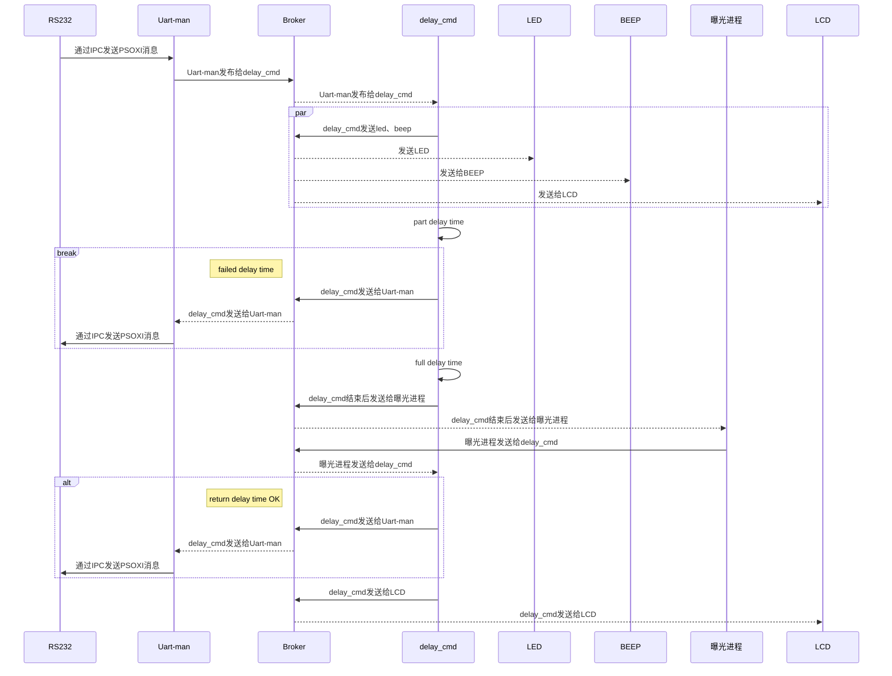

```mermaid  
sequenceDiagram  
participant A as RS232  
participant B as Uart-man  
participant Router as Broker  
participant C as delay_cmd  
participant D as LED  
participant E as BEEP 
participant F as 曝光进程
participant G as LCD

A->>B: 通过IPC发送PSOXI消息

B->>Router: Uart-man发布给delay_cmd  
Router-->>C: Uart-man发布给delay_cmd

par
	C->>Router: delay_cmd发送led、beep
	Router-->>D: 发送LED
	Router-->>E: 发送给BEEP
	Router-->>G: 发送给LCD
end

C->>C: part delay time 

break
	note left of Router: failed delay time
	C->>Router: delay_cmd发送给Uart-man     	
	Router-->>B: delay_cmd发送给Uart-man

	B->>A: 通过IPC发送PSOXI消息 
end

C->>C: full delay time

C->>Router: delay_cmd结束后发送给曝光进程      
Router-->>F: delay_cmd结束后发送给曝光进程

F->>Router: 曝光进程发送给delay_cmd      
Router-->>C: 曝光进程发送给delay_cmd

alt
note left of Router: return delay time OK
C->>Router: delay_cmd发送给Uart-man     	
Router-->>B: delay_cmd发送给Uart-man

B->>A: 通过IPC发送PSOXI消息 
end

C->>Router: delay_cmd发送给LCD      
Router-->>G: delay_cmd发送给LCD
  
```