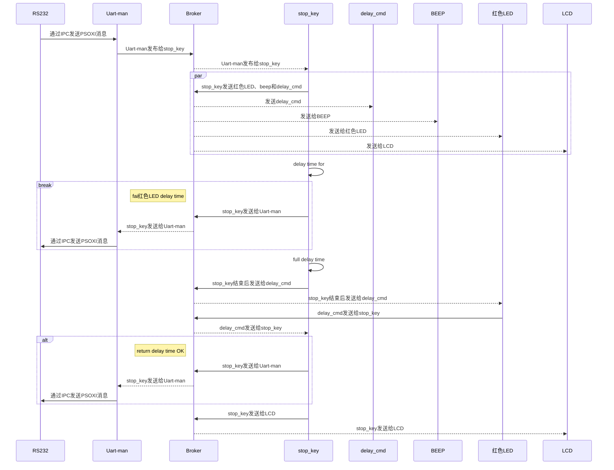

```mermaid  
sequenceDiagram  
participant A as RS232  
participant B as Uart-man  
participant Router as Broker  
participant C as stop_key  
participant D as delay_cmd  
participant E as BEEP 
participant F as 红色LED 
participant G as LCD

A->>B: 通过IPC发送PSOXI消息

B->>Router: Uart-man发布给stop_key  
Router-->>C: Uart-man发布给stop_key

par
	C->>Router: stop_key发送红色LED、beep和delay_cmd
	Router-->>D: 发送delay_cmd
	Router-->>E: 发送给BEEP
	Router-->>F: 发送给红色LED
	Router-->>G: 发送给LCD
end

C->>C: delay time for

break
	note left of Router: fai红色LED delay time
	C->>Router: stop_key发送给Uart-man     	
	Router-->>B: stop_key发送给Uart-man

	B->>A: 通过IPC发送PSOXI消息 
end

C->>C: full delay time

C->>Router: stop_key结束后发送给delay_cmd      
Router-->>F: stop_key结束后发送给delay_cmd

F->>Router: delay_cmd发送给stop_key      
Router-->>C: delay_cmd发送给stop_key

alt
note left of Router: return delay time OK
C->>Router: stop_key发送给Uart-man     	
Router-->>B: stop_key发送给Uart-man

B->>A: 通过IPC发送PSOXI消息 
end

C->>Router: stop_key发送给LCD      
Router-->>G: stop_key发送给LCD
  
```