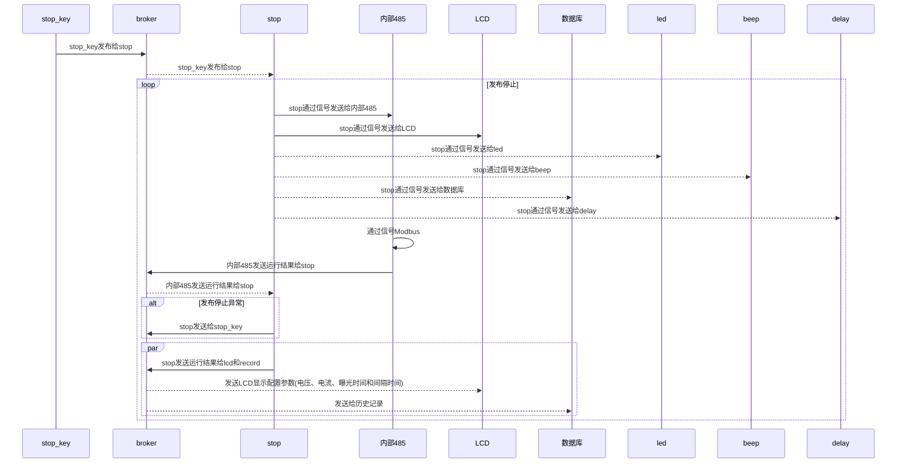

```mermaid  
sequenceDiagram  
participant A as stop_key  
participant Router as broker  
participant C as stop  
participant D as 内部485  
participant E as LCD 
participant F as 数据库 
participant G as led 
participant H as beep 
participant I as delay 

A->>Router: stop_key发布给stop  
Router-->>C: stop_key发布给stop 

	loop 发布停止
		C->>D: stop通过信号发送给内部485
		C->>E: stop通过信号发送给LCD
		C-->>G: stop通过信号发送给led
		C-->>H: stop通过信号发送给beep
		C-->>F: stop通过信号发送给数据库
		C-->>I: stop通过信号发送给delay
		D->>D: 通过信号Modbus
		
		D->>Router: 内部485发送运行结果给stop
		Router-->>C: 内部485发送运行结果给stop
		
		alt 发布停止异常
			C->>Router: stop发送给stop_key   
		end

		par
			C->>Router: stop发送运行结果给lcd和record
			Router-->>E: 发送LCD显示配置参数(电压、电流、曝光时间和间隔时间)  
			Router-->>F: 发送给历史记录
		end
	end
  
```
