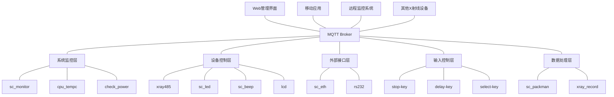

## 当前系统的不足

通过分析TQT113_linux_V2.0项目，我发现当前系统存在以下几个方面的不足：

1. **紧耦合的消息队列机制**：当前系统使用Linux原生消息队列(IPC)进行模块间通信，这种方式在单机环境下工作良好，但缺乏扩展性和灵活性
2. **缺乏分布式能力**：系统难以扩展到多设备协同工作的场景
3. **消息可靠性保障不足**：原生消息队列在系统崩溃时可能丢失消息
4. **缺乏消息持久化**：无法保存历史消息和状态
5. **监控和管理能力有限**：难以实时监控系统状态和消息流
6. **扩展性受限**：增加新模块需要修改现有代码结构

## 推荐架构：基于MQTT的中心化消息服务

考虑到嵌入式系统的资源限制和X射线设备的应用场景，我推荐采用**MQTT**作为中心化消息服务框架。

### 为什么选择MQTT？

1. **轻量级**：MQTT协议设计轻量，适合资源受限的嵌入式设备
2. **低带宽占用**：数据包小，网络开销低
3. **支持QoS**：提供三种服务质量级别，满足不同可靠性需求
4. **发布/订阅模式**：解耦发送者和接收者，更灵活的通信模式
5. **广泛支持**：有多种嵌入式平台的客户端实现
6. **断线重连机制**：支持网络不稳定环境下的可靠通信
7. **支持保留消息**：适合状态同步和配置下发

### 架构设计



## 具体实现方案

### 1. MQTT Broker选择

推荐使用**Mosquitto**作为MQTT Broker：
- 轻量级，资源占用少
- 可以部署在T113处理器上
- 开源，无许可证费用
- 支持TLS加密和用户认证
- 配置简单，易于维护

### 2. 主题设计

MQTT基于主题(Topic)的发布/订阅模式，建议按以下方式设计主题结构：

```
xray/{device_id}/{module}/{action}
```

例如：
- `xray/device001/xray485/status` - 射线机状态
- `xray/device001/xray485/command` - 射线机命令
- `xray/device001/lcd/update` - LCD显示更新
- `xray/device001/power/status` - 电源状态
- `xray/device001/system/log` - 系统日志

### 3. 模块改造

每个模块需要进行以下改造：

1. **添加MQTT客户端**：使用Eclipse Paho C客户端库
2. **替换消息队列**：将原有的IPC消息队列替换为MQTT发布/订阅
3. **定义消息格式**：使用JSON格式定义消息内容
4. **实现断线重连**：确保网络不稳定时的可靠通信
5. **添加QoS设置**：根据消息重要性设置不同的QoS级别

### 4. 系统监控改进

利用MQTT的特性，改进系统监控：

1. **心跳机制**：各模块定期发布心跳消息到`xray/{device_id}/{module}/heartbeat`主题
2. **状态监控**：sc_monitor订阅所有模块的心跳主题，检测模块状态
3. **远程重启**：通过`xray/{device_id}/{module}/control`主题发送重启命令
4. **日志收集**：所有模块将日志发布到`xray/{device_id}/system/log`主题

### 5. 数据持久化

添加数据持久化功能：

1. **本地存储**：使用SQLite存储重要数据和状态
2. **消息持久化**：配置MQTT Broker支持消息持久化
3. **历史记录**：保存射线机操作历史和状态变化

### 6. 安全性设计

加强系统安全性：

1. **TLS加密**：启用MQTT的TLS加密功能
2. **用户认证**：设置MQTT的用户名/密码认证
3. **访问控制**：配置MQTT的ACL(访问控制列表)
4. **安全日志**：记录所有安全相关事件

### 7. 扩展功能

基于新架构可以实现的扩展功能：

1. **Web管理界面**：开发基于Web的管理界面，连接MQTT Broker
2. **移动应用**：开发移动应用，远程监控和控制设备
3. **多设备协同**：支持多台X射线设备协同工作
4. **数据分析**：收集和分析设备运行数据
5. **远程升级**：通过MQTT推送固件更新

## 代码示例

### MQTT客户端初始化示例

```c
#include <stdio.h>
#include <stdlib.h>
#include <string.h>
#include <MQTTClient.h>

#define MQTT_BROKER     "tcp://localhost:1883"
#define MQTT_CLIENTID   "xray485_client"
#define MQTT_QOS        1
#define MQTT_TIMEOUT    10000L

MQTTClient client;
MQTTClient_connectOptions conn_opts = MQTTClient_connectOptions_initializer;

int mqtt_init() {
    int rc;
    
    // 创建MQTT客户端
    if ((rc = MQTTClient_create(&client, MQTT_BROKER, MQTT_CLIENTID,
        MQTTCLIENT_PERSISTENCE_NONE, NULL)) != MQTTCLIENT_SUCCESS) {
        syslog(LOG_ERR, "Failed to create MQTT client, return code %d\n", rc);
        return -1;
    }
    
    // 设置回调函数
    MQTTClient_setCallbacks(client, NULL, NULL, mqtt_message_callback, NULL);
    
    // 连接参数
    conn_opts.keepAliveInterval = 20;
    conn_opts.cleansession = 1;
    
    // 连接到MQTT Broker
    if ((rc = MQTTClient_connect(client, &conn_opts)) != MQTTCLIENT_SUCCESS) {
        syslog(LOG_ERR, "Failed to connect to MQTT broker, return code %d\n", rc);
        return -1;
    }
    
    // 订阅主题
    MQTTClient_subscribe(client, "xray/device001/xray485/command", MQTT_QOS);
    
    return 0;
}
```

### 消息发布示例

```c
int mqtt_publish_status(const char *device_id, float voltage, float current, float temperature) {
    MQTTClient_message pubmsg = MQTTClient_message_initializer;
    MQTTClient_deliveryToken token;
    char topic[100];
    char payload[256];
    int rc;
    
    // 构建主题
    snprintf(topic, sizeof(topic), "xray/%s/xray485/status", device_id);
    
    // 构建JSON消息
    snprintf(payload, sizeof(payload), 
             "{\"voltage\":%.2f,\"current\":%.2f,\"temperature\":%.2f,\"timestamp\":%ld}",
             voltage, current, temperature, time(NULL));
    
    // 设置消息内容
    pubmsg.payload = payload;
    pubmsg.payloadlen = strlen(payload);
    pubmsg.qos = MQTT_QOS;
    pubmsg.retained = 0;
    
    // 发布消息
    if ((rc = MQTTClient_publishMessage(client, topic, &pubmsg, &token)) != MQTTCLIENT_SUCCESS) {
        syslog(LOG_ERR, "Failed to publish message, return code %d\n", rc);
        return -1;
    }
    
    // 等待消息发送完成
    rc = MQTTClient_waitForCompletion(client, token, MQTT_TIMEOUT);
    
    return rc;
}
```

### 消息接收回调示例

```c
int mqtt_message_callback(void *context, char *topicName, int topicLen, MQTTClient_message *message) {
    char *payload = message->payload;
    size_t payload_len = message->payloadlen;
    char *payload_str = malloc(payload_len + 1);
    
    // 复制并添加字符串结束符
    memcpy(payload_str, payload, payload_len);
    payload_str[payload_len] = '\0';
    
    syslog(LOG_INFO, "Received message on topic: %s, payload: %s\n", topicName, payload_str);
    
    // 处理命令消息
    if (strstr(topicName, "/xray485/command") != NULL) {
        // 解析JSON命令
        cJSON *root = cJSON_Parse(payload_str);
        if (root) {
            // 处理命令
            process_command(root);
            cJSON_Delete(root);
        }
    }
    
    free(payload_str);
    MQTTClient_freeMessage(&message);
    MQTTClient_free(topicName);
    
    return 1;
}
```

## 迁移策略

为了平稳迁移到新架构，建议采用以下策略：

1. **分阶段迁移**：
   - 第一阶段：部署MQTT Broker，保留原有消息队列
   - 第二阶段：逐个模块添加MQTT客户端，同时支持两种通信方式
   - 第三阶段：完全切换到MQTT通信，移除旧消息队列

2. **兼容层设计**：
   - 开发一个适配层，将MQTT消息转换为原有消息格式
   - 确保新旧系统可以共存

3. **测试策略**：
   - 为每个模块开发单元测试
   - 设计端到端测试验证系统功能
   - 进行性能和压力测试

## 总结

基于MQTT的中心化消息服务架构可以显著改善TQT113_linux_V2.0系统的以下方面：

1. **解耦模块依赖**：通过发布/订阅模式降低模块间耦合
2. **提高系统可靠性**：利用MQTT的QoS机制确保消息可靠传递
3. **增强扩展性**：轻松添加新模块和功能
4. **支持分布式部署**：实现多设备协同工作
5. **改进监控能力**：全面监控系统状态和消息流
6. **提供远程访问**：支持远程监控和控制
7. **数据持久化**：保存历史数据和状态

这一架构不仅解决了当前系统的不足，还为未来功能扩展和系统升级提供了坚实基础。
