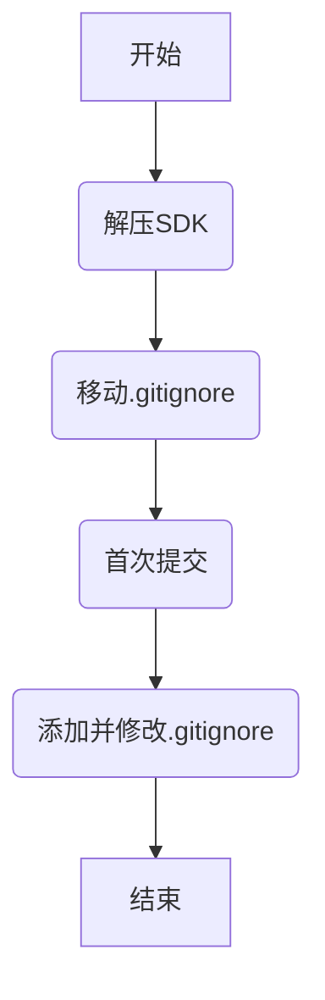

# 一 创建思路

# 二 原始修改内容

#### 1 原主要修改文件
![[Pasted image 20250324150308.png]]
#### 2 修改文件的SHA

![[Pasted image 20250324161101.png]]

# 三 SDK包
#### 1 SDK压缩包以及SHA

![[Pasted image 20250324154050.png]]
#### 2 解压SDK压缩包

![[Pasted image 20250324154700.png]]
#### 3 解压SDK压缩包容量

![[Pasted image 20250324155154.png]]

# 四 创建远端空git repo
#### 1 连接
http://192.168.30.23:9080/software/xray_control_system

#### 2 commit图
![[Pasted image 20250325163206.png]]

# 五 创建SDK git repo

#### 1 初次提交

![[Pasted image 20250325164455.png]].

#### 2 添加.gitignore

![[Pasted image 20250325164938.png]]
#### 3 编译修改后的repo

![[Pasted image 20250325164616.png]]

#### 4 历史记录

ocean@ocean-VirtualBox:~$ history
    1  ifconfig
    2  sudo apt install net-tools
    3  ifconfig
    4  clear
    5  sudo poweroff
    6  ifconfig
    7  df -h
    8  ifconfig
    9  sudo reboot
   10  ifconfig
   11  ping 192.168.10.114
   12  sshd
   13  sudo apt install openssh-server
   14  apt-get update
   15  sudo apt install openssh-server
   16  ps
   17  ps aux |grep sshd
   18  sudo poweroff
   19  openssh
   20  sudo apt update
   21  sudo apt install openssh-server
   22  ifconfig
   23  pwd
   24  ifconfig
   25  ping 192.168.10.114
   26  clear
   27  cd ~
   28  CD .SSH
   29  cd .ssh
   30  clear
   31  ls
   32  clear
   33  ifocnfig
   34  ifconfig
   35  sudo poweroff
   36  pwd
   37  cd /opt
   38  ls
   39  clear
   40  ls
   41  cd ..
   42  ls
   43  ll
   44  chmod 777 ./opt
   45  sudo chmod 777 ./opt
   46  clear
   47  ls
   48  cd /opt
   49  ls
   50  md5sum TQT113_linux_V2.0.tar.bz2
   51  sudo poweroff
   52  clear
   53  ssh -T git@192.168.30.23
   54  cd .ssh
   55  ls
   56  ll
   57  chmod 600 id_ed25519
   58  ll
   59  ssh -T git@192.168.30.23
   60  clear
   61  cd /opt
   62  ld
   63  clear
   64  ls
   65  tar
   66  gcc
   67  sudo apt install gcc
   68  binutils
   69  sudo apt install binuntils
   70  sudo apt install binutils
   71  sudo apt install find
   72  find
   73  clear
   74  make
   75  sudo apt install make
   76  diff
   77  grep
   78  clear
   79  perl
   80  clear
   81  tar
   82  tar --help
   83  clear
   84  flex
   85  sudo apt install flex
   86  apt-get update
   87  sudo apt-get update
   88  gcc
   89  sudo apt install gcc
   90  clear
   91  sudo apt update
   92  sudo apt list --upgradable
   93  sudo apt upgrade
   94  sudo apt upgrade --fix-missing
   95  gcc
   96  sudo apt install gcc
   97  sudo apt install gcc  --fix-missing
   98  clear
   99  ls
  100  tar
  101  clear
  102  ls
  103  tar jxvf TQT113_linux_V2.0.tar.bz2
  104  clear
  105  ls
  106  rm -rf TQT113_linux_V2.0
  107  clear
  108  ls
  109  md5sum TQT113_linux_V2.0.tar.bz2 > md5sum_result.txt
  110  ls
  111  cat md5sum_result.txt
  112  md5sum TQT113_linux_V2.0.tar.bz2
  113  clear
  114  ls
  115  clear
  116  ls
  117  md5sum TQT113_linux_V2.0.tar.bz2
  118  ls
  119  tar jxvf TQT113_linux_V2.0.tar.bz2
  120  ls
  121  du -sh ./TQT113_linux_V2.0
  122  clear
  123  ls
  124  cd TQT113_linux_V2.0/
  125  ll
  126  cd ..
  127  ls
  128  mkdir ignore_file
  129  clear
  130  ls
  131  ll
  132  clear
  133  cd TQT113_linux_V2.0/
  134  ls
  135  clear
  136  ll
  137  cp .gitignore ../ignore_file/
  138  clear
  139  ls
  140  clear
  141  ll
  142  md5sum .gitignore
  143  clear
  144  ll
  145  cd brandy/
  146  ls
  147  cd brandy-2.0/
  148  ls
  149  cd u-boot-2018/
  150  ls
  151  ll
  152  clear
  153  ll
  154  cp .gitignore ../../../../ignore_file/.gitignore_uboot
  155  md5sum .gitignore
  156  cd -
  157  cd ..
  158  clear
  159  ls
  160  ll
  161  cd buildroot/buildroot-201902/package/
  162  clear
  163  ll
  164  clear
  165  ll
  166  ls |grep .git
  167  ls |grep .gitignor
  168  clear
  169  cd ..
  170  clear
  171  find . -name ".gitignor"
  172  find . -name ".gitignore"
  173  cd ./buildroot/buildroot-201902/package/
  174  find . -name ".gitignore"
  175  ll
  176  clear
  177  cd -
  178  clear
  179  find . -name ".gitignore"
  180  cp ./buildroot/buildroot-201902/package/.gitignore ../ignore_file/.gitignore_pack
  181  clear
  182  ls
  183  clear
  184  find . -name ".gitignore"
  185  md5sum ./buildroot/buildroot-201902/package/.gitignore
  186  clear
  187  find . -name ".gitignore"
  188  rm ./.gitignore
  189  find . -name ".gitignore"
  190  rm ./brandy/brandy-2.0/u-boot-2018/.gitignore
  191  find . -name ".gitignore"
  192  rm ./buildroot/buildroot-201902/package/.gitignore
  193  git st
  194  find . -name ".gitignore"
  195  cd /opt
  196  ls
  197  clear
  198  ls
  199  cd ignore_file/
  200  ll
  201  clear
  202  ll
  203  md5sum .gitignore
  204  clear
  205  ll
  206  ls
  207  ll
  208  md5sum .gitignore_uboot
  209  ll
  210  md5sum .gitignore
  211  md5sum .gitignore_pack
  212  clear
  213  ll
  214  git
  215  git
  216  sudo apt install git --fix-missing
  217  apt install git
  218  sudo apt install git
  219  ping -c 4 cn.archive.ubuntu.com
  220  clear
  221  cd /etc
  222  ls
  223  clear
  224  cd apt
  225  ls
  226  cat sources.list
  227  clear
  228  git
  229  sudo apt install git
  230  interface
  231  clear
  232  sudo apt install git
  233  clear
  234  ls
  235  cp sources.list sources_bk.list
  236  sudo cp sources.list sources_bk.list
  237  clear
  238  ll
  239  sudo vi sources.list
  240  clear
  241  sudo apt install git
  242  git
  243  clear
  244  unzip
  245  getopt
  246  gawk
  247  sudo apt install gawk
  248  ifconfig
  249  clear
  250  ifconfig
  251  git
  252  sudo apt install git
  253  clear
  254  ifconfig
  255  sudo apt install git
  256  gcc
  257  sudo apt install gcc
  258  make
  259  sudo apt install make
  260  clear
  261  flex
  262  sudo apt install flex
  263  diff
  264  flex
  265  getopt
  266  gawk
  267  sudo apt install gawk
  268  binutls
  269  binutils
  270  patch
  271  bison
  272  sudo apt install bison
  273  curl
  274  sudo apt  install curl
  275  clear
  276  sudo poweroff
  277  ifconfig
  278  cd /opt
  279  ls
  280  clear
  281  ls
  282  cd ignore_file
  283  clear
  284  ls
  285  git config --global alias.br branch
  286  git br
  287  git config --global alias.st status
  288  clear
  289  ls
  290  clear
  291  ll
  292  cp .gitignore ../TQT113_linux_V2.0
  293  clear
  294  ll
  295  cp .gitignore_uboot ../TQT113_linux_V2.0/brandy/brandy-2.0/u-boot-2018/
  296  clear
  297  ll
  298  cp .gitignore_pack ../TQT113_linux_V2.0/buildroot/buildroot-201902/package/
  299  clear
  300  ls
  301  ll
  302  clear
  303  ifconfig
  304  git
  305  clear
  306  cd /opt
  307  ls
  308  ssh -T 192.168.30.23
  309  ssh -T git@192.168.30.23
  310  clear
  311  ls
  312  clear
  313  ls
  314  cd TQT113_linux_V2.0
  315  clear
  316  ll
  317  git init --initial-branch=main
  318  git br
  319  git branch
  320  git st
  321  git status
  322  git remote add origin git@192.168.30.23:software/xray_control_system.git
  323  git remote -v
  324  git status
  325  cd ..
  326  ls
  327  cd TQT113_linux_V2.0
  328  git status
  329  git add .
  330  git status
  331  git commit -m "Initial commit"
  332  git config --global user.email "nan.wang@scom.com"
  333  git config --global user.name "Nan Wang"
  334  git commit -m "Initial commit"
  335  git lgo -3
  336  git log -3
  337  git push --set-upstream origin main
  338  clear
  339  git log -3
  340  git br
  341  git st
  342  clear
  343  history
  344  clear
  345  git st
  346  git br
  347  clear
  348  git st
  349  git add .gitignore
  350  clear
  351  git st
  352  clear
  353  git st
  354  mv brandy/brandy-2.0/u-boot-2018/.gitignore_uboot brandy/brandy-2.0/u-boot-2018/.gitignore
  355  clear
  356  git st
  357  git add brandy/brandy-2.0/u-boot-2018/.gitignore
  358  clear
  359  git st
  360  mv buildroot/buildroot-201902/package/.gitignore_pack buildroot/buildroot-201902/package/.gitignore
  361  clear
  362  git st
  363  git add buildroot/buildroot-201902/package/.gitignore
  364  clear
  365  git st
  366  git commit
  367  git push origin main
  368  clear
  369  git st
  370  ifconfig
  371  clear
  372  git st
  373  git diff
  374  clear
  375  git st
  376  git add .gitignore
  377  git st
  378  git commit
  379  git log -3
  380  git push origin main
  381  git br
  382  clear
  383  df -h
  384  sudo poweroff
  385  clear
  386  sudo poweroff
  387  clear
  388  socat
  389  sudo apt install socat
  390  clear
  391  make
  392  gcc
  393  gcc -v
  394  clear
  395  binutils
  396  sudo apt install binutils
  397  bzip2
  398  bzip2 -v
  399  bzip2 --help
  400  flex
  401  sudo apt install flex
  402  sudo apt install perl
  403  sudo apt install ia32-libs
  404  sudo apt install lib32z1
  405  sudo apt install ia32-libs
  406  clear
  407  subversion
  408  subver-sion
  409  sudo apt install subver-sion
  410  sudo apt install subversion
  411  sudo apt install libz-dev
  412  sudo apt install libc-dev
  413  clear
  414  sudo apt install libc-dev
  415  sudo apt autoremove
  416  clear
  417  sudo apt-gey install
  418  sudo apt-get install
  419  sudo apt-get upgrade -y
  420  clear
  421  sudo apt update
  422  sudo apt upgrade
  423  clear
  424  sudo apt-get update && sudo apt-get install -y patch build-essential git gnupg flex bison gperf vim zip unzip p7zip p7zip-full bzip2 pigz pbzip2 pixz rar unrar curl zlib1g-dev libc6-dev lib32ncurses-dev x11proto-core-dev libx11-dev lib32z1-dev libgl1-mesa-dev gcc-multilib g++-multilib tofrodos libxml2-utils genext2fs xsltproc kpartx uuid uuid-dev liblzo2-2 liblzo2-dev libtool libdb++-dev libprotobuf-dev protobuf-compiler gawk texinfo libexpat1-dev multistrap qemu qemu-user-static qemu-system binfmt-support dpkg-cross u-boot-tools mtd-utils minicom valgrind imagemagick libmpc-dev ccache ntfs-3g exfat-fuse traceroute liblz4-tool gparted iptux usb-creator-gtk zstd fastboot device-tree-compiler mtools parted libusb-1.0-0-dev autotools-dev libsigsegv2 m4 intltool libdrm-dev cpio libgtk2.0-dev openssh-client w3m graphviz expect bc patchelf live-build cmake swig proot autoconf sed make binutils gzip perl tar rsync file wget libglib2.0-dev cvs mercurial subversion asciidoc xutils-dev libwayland-bin lockfile-progs iperf strace net-tools iw iputils-ping tree mediainfo bluez systemtap-sdt-dev libsdl1.2-dev diffstat chrpath coreutils texi2html docbook-utils help2man desktop-file-utils automake groff lzop xterm socat debianutils python3-git python3-jinja2 python3-pip python3-pexpect xz-utils gettext msmtp xmlto qemu-utils autopoint libelf-dev gdisk debootstrap pbuilder ubuntu-keyring debian-keyring debian-archive-keyring fcitx libudev-dev android-sdk-ext4-utils libyaml-dev libghc-gnutls-dev libdw-dev dwarves lz4 clang ninja-build lksctp-tools pkg-config freeglut3-dev libatspi2.0-dev libxkbcommon-dev libxcb-util-dev libxcb-render-util0-dev libxcb-randr0-dev libxcb-shape0-dev libxcb-xfixes0-dev libxcb1-dev libxcb-glx0-dev libxcb-keysyms1-dev libxcb-image0-dev libxcb-shm0-dev libxcb-icccm4-dev libxcb-sync-dev libfontconfig1-dev libfreetype6-dev libx11-xcb-dev libxext-dev libxi-dev libxrender-dev
  425  clear
  426  sudo poweroff
  427  clear
  428  sudo apt-get update && sudo apt-get install -y patch build-essential git gnupg flex bison gperf vim zip unzip p7zip p7zip-full bzip2 pigz pbzip2 pixz rar unrar curl zlib1g-dev libc6-dev lib32ncurses-dev x11proto-core-dev libx11-dev lib32z1-dev libgl1-mesa-dev gcc-multilib g++-multilib tofrodos libxml2-utils genext2fs xsltproc kpartx uuid uuid-dev liblzo2-2 liblzo2-dev libtool libdb++-dev libprotobuf-dev protobuf-compiler gawk texinfo libexpat1-dev multistrap qemu qemu-user-static qemu-system binfmt-support dpkg-cross u-boot-tools mtd-utils minicom valgrind imagemagick libmpc-dev ccache ntfs-3g exfat-fuse traceroute liblz4-tool gparted iptux usb-creator-gtk zstd fastboot device-tree-compiler mtools parted libusb-1.0-0-dev autotools-dev libsigsegv2 m4 intltool libdrm-dev cpio libgtk2.0-dev openssh-client w3m graphviz expect bc patchelf live-build cmake swig proot autoconf sed make binutils gzip perl tar rsync file wget libglib2.0-dev cvs mercurial subversion asciidoc xutils-dev libwayland-bin lockfile-progs iperf strace net-tools iw iputils-ping tree mediainfo bluez systemtap-sdt-dev libsdl1.2-dev diffstat chrpath coreutils texi2html docbook-utils help2man desktop-file-utils automake groff lzop xterm socat debianutils python3-git python3-jinja2 python3-pip python3-pexpect xz-utils gettext msmtp xmlto qemu-utils autopoint libelf-dev gdisk debootstrap pbuilder ubuntu-keyring debian-keyring debian-archive-keyring fcitx libudev-dev android-sdk-ext4-utils libyaml-dev libghc-gnutls-dev libdw-dev dwarves lz4 clang ninja-build lksctp-tools pkg-config freeglut3-dev libatspi2.0-dev libxkbcommon-dev libxcb-util-dev libxcb-render-util0-dev libxcb-randr0-dev libxcb-shape0-dev libxcb-xfixes0-dev libxcb1-dev libxcb-glx0-dev libxcb-keysyms1-dev libxcb-image0-dev libxcb-shm0-dev libxcb-icccm4-dev libxcb-sync-dev libfontconfig1-dev libfreetype6-dev libx11-xcb-dev libxext-dev libxi-dev libxrender-dev
  429  clear
  430  sudo apt-get update && sudo apt-get install -y patch build-essential git gnupg flex bison gperf vim zip unzip p7zip p7zip-full bzip2 pigz pbzip2 pixz rar unrar curl zlib1g-dev libc6-dev lib32ncurses-dev x11proto-core-dev libx11-dev lib32z1-dev libgl1-mesa-dev gcc-multilib g++-multilib tofrodos libxml2-utils genext2fs xsltproc kpartx uuid uuid-dev liblzo2-2 liblzo2-dev libtool libdb++-dev libprotobuf-dev protobuf-compiler gawk texinfo libexpat1-dev multistrap qemu qemu-user-static qemu-system binfmt-support dpkg-cross u-boot-tools mtd-utils minicom valgrind imagemagick libmpc-dev ccache ntfs-3g exfat-fuse traceroute liblz4-tool gparted iptux usb-creator-gtk zstd fastboot device-tree-compiler mtools parted libusb-1.0-0-dev autotools-dev libsigsegv2 m4 intltool libdrm-dev cpio libgtk2.0-dev openssh-client w3m graphviz expect bc patchelf live-build cmake swig proot autoconf sed make binutils gzip perl tar rsync file wget libglib2.0-dev cvs mercurial subversion asciidoc xutils-dev libwayland-bin lockfile-progs iperf strace net-tools iw iputils-ping tree mediainfo bluez systemtap-sdt-dev libsdl1.2-dev diffstat chrpath coreutils texi2html docbook-utils help2man desktop-file-utils automake groff lzop xterm socat debianutils python3-git python3-jinja2 python3-pip python3-pexpect xz-utils gettext msmtp xmlto qemu-utils autopoint libelf-dev gdisk debootstrap pbuilder ubuntu-keyring debian-keyring debian-archive-keyring fcitx libudev-dev libyaml-dev libdw-dev dwarves lz4 clang ninja-build lksctp-tools pkg-config freeglut3-dev libatspi2.0-dev libxkbcommon-dev libxcb-util-dev libxcb-render-util0-dev libxcb-randr0-dev libxcb-shape0-dev libxcb-xfixes0-dev libxcb1-dev libxcb-glx0-dev libxcb-keysyms1-dev libxcb-image0-dev libxcb-shm0-dev libxcb-icccm4-dev libxcb-sync-dev libfontconfig1-dev libfreetype6-dev libx11-xcb-dev libxext-dev libxi-dev libxrender-dev
  431  clear
  432  sudo apt-file search libz.so.1
  433  sudo apt-get install apt-file
  434  sudo apt-file search libz.so.1
  435  apt-file update
  436  sudo apt-file update
  437  clear
  438  sudo apt-file search libz.so。2
  439  sudo apt-file search libz.so.2
  440  sudo apt-file search libz.so.1
  441  clear
  442  cd /opt
  443  reboot
  444  sudo preboot
  445  sudo reboot
  446  ifconfig
  447  cd/opt
  448  cd /opt
  449  clear
  450  ls
  451  cd TQT113_linux_V2.0/
  452  clear
  453  ./auto_build.sh t113_s4 buildroot
  454  python
  455  sudo apt-get update
  456  sudo apt-get install python2
  457  sudo apt-get install python-is-python3
  458  clear
  459  ./auto_build.sh t113_s4 buildroot
  460  sudo apt install libssl-dev
  461  ./auto_build.sh t113_s4 buildroot
  462  ifconfig
  463  git st
  464  git st
  465  git checkout -- device/config/chips/t113_s4/bin/fes1_sun8iw20p1.bin device/config/chips/t113_s4/bin/u-boot-sun8iw20p1.bin
  466  git st
  467  git pull
  468  clear
  469  git log
  470  clear
  471  git log
  472  clear
  473  history
ocean@ocean-VirtualBox:~$

