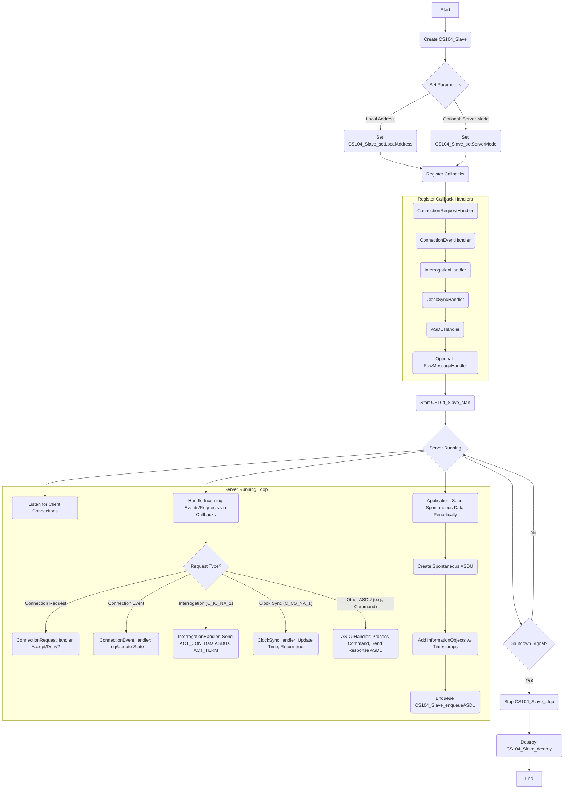

```mermaid
graph TD
    A[Start] --> B(Create CS104_Slave);
    B --> C{Set Parameters};
    C -- Local Address --> D(Set CS104_Slave_setLocalAddress);
    C -- Optional: Server Mode --> E(Set CS104_Slave_setServerMode);
    D --> F(Register Callbacks);
    E --> F;

    subgraph Register Callbacks [Register Callback Handlers]
        direction LR
        F1(ConnectionRequestHandler)
        F2(ConnectionEventHandler)
        F3(InterrogationHandler)
        F4(ClockSyncHandler)
        F5(ASDUHandler)
        F6(Optional: RawMessageHandler)
    end

    F --> F1 --> F2 --> F3 --> F4 --> F5 --> F6;

    F6 --> G(Start CS104_Slave_start);

    G --> H{Server Running};

    subgraph Server Operations [Server Running Loop]
        direction TB
        H1(Listen for Client Connections);
        H2(Handle Incoming Events/Requests via Callbacks);
        H3(Application: Send Spontaneous Data Periodically);

        H2 --> H2A{Request Type?};
        H2A -- Connection Request --> H2B(ConnectionRequestHandler: Accept/Deny?);
        H2A -- Connection Event --> H2C(ConnectionEventHandler: Log/Update State);
        H2A -- Interrogation (C_IC_NA_1) --> H2D(InterrogationHandler: Send ACT_CON, Data ASDUs, ACT_TERM);
        H2A -- Clock Sync (C_CS_NA_1) --> H2E(ClockSyncHandler: Update Time, Return true);
        H2A -- Other ASDU (e.g., Command) --> H2F(ASDUHandler: Process Command, Send Response ASDU);

        H3 --> H3A(Create Spontaneous ASDU);
        H3A --> H3B(Add InformationObjects w/ Timestamps);
        H3B --> H3C(Enqueue CS104_Slave_enqueueASDU);
    end

    H --> H1;
    H --> H2;
    H --> H3;

    H --> I{Shutdown Signal?};
    I -- Yes --> J(Stop CS104_Slave_stop);
    I -- No ----> H;

    J --> K(Destroy CS104_Slave_destroy);
    K --> L[End];
```

