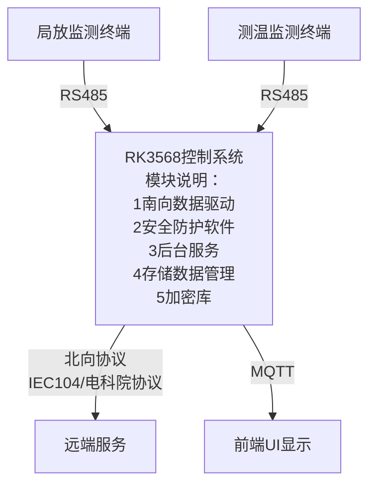

# 一 设计概要
### 1 设计背景
当前公司供货用平板为安卓系统，不满足电力要求，需要Linux系统平板供货。

### 2 软件框架 

### 3 模块框架 

![[Pasted image 20250417115246.png]]

### 4 主要软件模块
#### (1)硬件控制模块
包含2个模块： 负责硬件收发模块和硬件逻辑处理模块

![[Pasted image 20250417131531.png]]

#### (2)后端服务模块
主要包含3个模块
1） 协议数据的发送和接受
通过packman和参数配置进程通信，动态确定协议类型（IEC104）和 广电协议。

2） 数据库模块
含数据库与文件管理，满足至少1年历史数据存储与下载查看。

3） 参数配置模块

4） 数据加密库
	使用==mbedTLS或者OpenSSL

![[Pasted image 20250417131915.png]]

#### (3)系统内通信协议
系统内部通信协议比较如下：

| 特性/工具     | MQTT    | RabbitMQ | Crow      | libco    | async simple | **libgo**    |
| :-------- | :------ | :------- | :-------- | :------- | :----------- | :----------- |
| **协议类型**  | 轻量级消息协议 | AMQP协议   | HTTP协议    | C语言协程库   | C++异步编程库     | 无特定协议，C++协程库 |
| **语言**    | 多语言支持   | 多语言支持    | C++       | C语言      | C++          | C++          |
| **功能丰富度** | 简单      | 丰富       | 中等        | 简单       | 中等           | 中等           |
| **性能**    | 高       | 中等       | 高         | 高        | 高            | 高            |
| **适用场景**  | 物联网设备通信 | 企业级消息中间件 | 小型HTTP服务器 | 高并发C语言项目 | 异步C++项目      | 高性能并发C++项目   |
| **上手难度**  | **低**   | **中等**   | **中等**    | **低**    | **中等**       | 中等           |
|           |         |          |           |          |              |              |

针对内部MQTT和libco的比较

| 对比维度     | 内部MQTT                                   | libco                                 |
| :------- | :--------------------------------------- | :------------------------------------ |
| **模块解耦** | 高度解耦，基于发布/订阅模式，模块间通过主题通信，无需直接连接。适合分布式系统。 | 耦合度相对较高，模块间通过函数调用或事件回调通信，适合本地紧密协作。    |
| **通信方式** | 支持一对多、多对一、多对多通信，通过消息代理中转消息，适合大规模分布式系统。   | 主要适用于本地模块间通信，不适合分布式系统，通信方式较为单一。       |
| **性能**   | 轻量级协议，适合小数据量传输，消息头小，资源消耗低，支持多种QoS级别。     | 高性能，基于协程的异步处理，减少线程切换开销，适合高并发场景，实时性高。  |
| **资源消耗** | 需要消息代理，但代理可设计为高可用性，适合大规模设备接入，资源消耗低。      | 不需要额外消息代理，直接在系统内部通信，资源占用低。            |
| **开发难度** | 开发简单，协议简单易用，有大量开源客户端库，社区支持好，易于上手。        | 开发复杂，需要熟悉协程和异步编程，调试困难，依赖开发团队经验。       |
| **维护难度** | 维护方便，模块间通过主题通信，修改一个模块通常不影响其他模块。          | 维护难度大，异步逻辑复杂，代码可读性和可维护性可能较差。          |
| **适用场景** | 分布式系统、低耦合需求、网络环境复杂、大规模设备接入。              | 本地高性能系统、实时性要求高、资源受限环境、模块间紧密协作。        |
| **部署方式** | 需部署消息代理（Broker），适合分布式部署。                 | 不需要额外组件，直接在本地系统中使用，适合单机或本地部署。         |
| **可靠性**  | 支持多种QoS级别，可确保消息可靠传输，但依赖消息代理的高可用性设计。      | 无内置可靠性机制，需要自行实现消息确认等机制，适合对可靠性要求不高的场景。 |
| **实时性**  | 实时性有限，受消息代理和网络延迟影响，适合对实时性要求不极端的场景。       | 实时性高，数据直接在本地模块间传递，适合对实时性要求高的场景。       |
结论：
系统需要模块解耦合，保持强维护度，
==因此使用**内部的MQTT**，
而**Rabbit MQ** 作为备选==
# 二 软件功能列表
### 1 北向和南向数据功能

| 分类  | 需求标题    | 需求内容                                            |
| --- | ------- | ----------------------------------------------- |
| 下行  | 测温数据查询  | 一个单独的物理485串口，以主机方式查询RFID采集器数据，并存储到数据库，查询时间周期可配置 |
| 下行  | 局放数据查询  | 一个单独的物理485串口，以主机方式查询局放采集器数据，并存储到数据库，查询时间周期可配置   |
| 上行  | 104协议   | 遵循标准104协议，FMA测试                                 |
| 上行  | 广东电科院协议 | 遵循《广东电科院协议》                                     |
### 2 配置功能

| 分类  | 需求标题 | 需求内容                        |
| --- | ---- | --------------------------- |
| 配置  | 测温   | 设置设备号，广东电科院使用，SK开头，如：SK0001 |
|     |      | 设置发射功率                      |
|     |      | 设置告警阈值，包括温度预警，告警，三相不平衡      |
|     |      | 串口配置                        |
|     |      | 设置ID                        |
|     |      | 设置告警阈值                      |
| 配置  | 局放   | 设置背景噪声                      |
|     |      | 串口配置                        |
### 3 存储数据功能

| 分类      | 需求标题   | 需求内容                |     |
| ------- | ------ | ------------------- | --- |
| 数据存储与导出 | TF方式   | 导出db                |     |
|         |        | excel数据导出           |     |
|         | EMMC方式 | EMMC存db             |     |
|         |        | 导出db                |     |
|         |        | excel数据导出           |     |
|         | USB导出  | 插入U盘可以复制内部文件及导出内部文件 |     |
