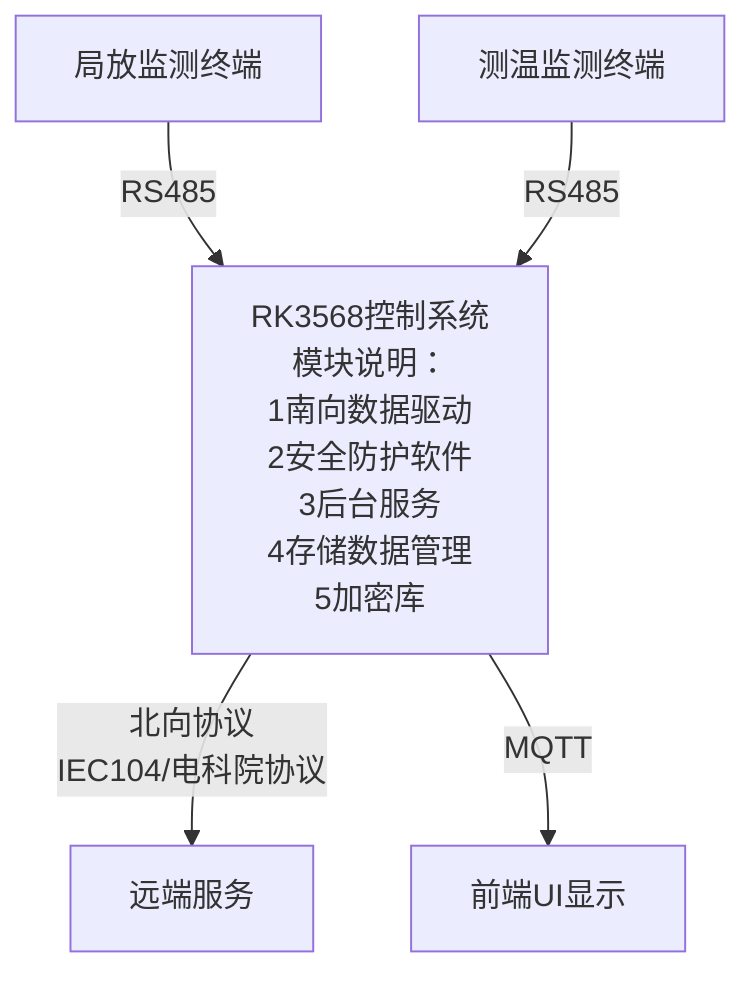

### 一 硬件平台
1. 主板采用RK3568（3562）工控一体机板，搭配7寸触摸屏幕。

| 参数名称   | 参数值                  |
| ------ | -------------------- |
| CPU处理器 | RK3568/4核A55主频2.0GHz |
| 运行内存   | 4GB                  |
| 存储     | EMMC 32GB            |
| GPU    | Mali-G52             |
| 操作系统   | Android 11           |
| 产品尺寸   | 7寸                   |
| 亮度     | 400cd/m²             |
| 分辨率    | 1024×600             |
| 视角     | 全视角                  |
| 触摸形式   | 5点电容式触摸              |
| 整机尺寸   | 195.5×127.3×32.7（mm） |

2. 硬件接口支持：

| 接口类型  | 描述                                   |     |
| ----- | ------------------------------------ | --- |
| 网口    | 1×10/100M自适应以太网，支持Ethernet；可选配2个网口   |     |
| 串口    | 2×RS485和2×RS232；其中2个RS485串口均可改为RS232 |     |
| USB   | 2×USB 2.0和2×USB 3.0                  |     |
| HDMI  | 1×HDMI OUT 2.0，支持4K 60fps输出          |     |
| GPIO  | 4×GPIO口，2路输入和2路输出                    |     |
| 耳机座   | 1×3.5mm耳机和麦克风二合一                     |     |
| 功放    | 1×功放                                 |     |
| SIM卡座 | 1×Nano SIM卡座（小卡），需选配4G模块后方可使用        |     |
|       |                                      |     |
3. 接口功能说明

| 接口    | 说明                                                            |
| ----- | ------------------------------------------------------------- |
| 网口    | 有线网口接网线，实现平板与变电站的局域网连接。                                       |
| USB   | 调试开发及实施过程中的应用升级，数据导入导出；后续利用一个USB口，接以太网转换器，实现本地连接微功率无线系统的汇聚节点。 |
| RS485 | 连接外部传感器终端，按协议实现数据采集及其他业务。                                     |
| RS232 | 连接外部传感器终端，按协议实现数据采集及其他业务。                                     |
### 二 功能需求

| 需求ID | 分类      | 需求标题    | 需求内容                                             | 备注                                      |
| ---- | ------- | ------- | ------------------------------------------------ | --------------------------------------- |
| 1    | 下行      | 测温数据查询  | 一个单独的物理485串口，以主机方式查询RFID采集器数据，并存储到数据库，查询时间周期可配置。 | 查询时间周期：2~3600秒，一般配置20s以上，速率过快长时间工作损伤传感器 |
|      |         | 局放数据查询  | 一个单独的物理485串口，以主机方式查询局放采集器数据，并存储到数据库，查询时间周期可配置。   |                                         |
| 2    | 上行      | 104协议   | 遵循标准104协议，PMA测试                                  | 协议需要自己网上找或参看朱本前的源码（TCP协议）               |
|      |         | 广东电科院协议 | 遵循《广东电科院协议》                                      | 比如：开机联络，总召，心跳，对时，稳定性                    |
|      |         | 网口驱动    | 104协议与广东电科院协议都通过网口传输                             | 参看《广东电科院协议》或参看朱本前的源码（UDP协议）             |
| 3    | 配置      | 测温      | 设置ID                                             |                                         |
|      |         |         | 设置发射功率                                           |                                         |
|      |         |         | 设置设备号，广东电科院使用，5K开头，如：SK0001                      |                                         |
|      |         |         | 设置告警阈值，包括温度预警，告警，三相不平衡                           | 比如串口号，波特率                               |
|      |         |         | 串口配置                                             |                                         |
| 4    | 配置      | 局放      | 设置ID                                             |                                         |
|      |         |         | 设置告警阈值                                           |                                         |
|      |         |         | 设置背景噪声                                           | 设置了背景噪声，显示的值会在原有的基础上减去背景噪声              |
|      |         |         | 串口配置                                             |                                         |
| 5    | 数据处理    | 测温数据处理  | 算法                                               |                                         |
|      |         |         | 告警                                               | 对设置的阈值进行处理                              |
| 6    | 数据处理    | 局放数据处理  | 告警                                               | 对设置的阈值进行处理                              |
|      |         |         | 背景噪声                                             |                                         |
| 7    | 数据存储与导出 | EMMC方式  | EMMC存db                                          |                                         |
|      |         |         | 导出db                                             |                                         |
|      |         |         | excel数据导出                                        |                                         |
|      |         |         | USB导出                                            | 插入U盘可以复制内部文件及导出内部文件                     |

### 三 软件框架

#### 1 主要框架图

![[平板方案 1.png]]

#### 2 北向数据方案

负责通过IEC104或者广电电科院协议传输数据
![[Pasted image 20250422145351.png]]

- 模块划分：EC104进程，广电协议进程，pack-man进程和配置进程
- 模块关系：每次收发消息前，pack-man进程通过和配置进程交互后获取json文件中的协议信息，
根据配置信息选择对应的协议模块进行数据交互

#### 3 南向数据方案

负责通过RS485接口获取温度数据和局放数据给对外协议进程或者数据库进程

![[Pasted image 20250422172143.png]]

- 模块划分：task485进程
- 模块关系：通过pack-man下放消息给task485，该进程返数据给数据库进程

#### 3 数据存储管理

1. 数据库位置
/root/terminal_data.db

2. 数据库的属性
	**current_data.db**：  
	- TEMPC_DATA（温度数据）  
	- PARTIAL_DISCHARGE_DATA（局放数据）  
	- WARN_RECORD（报警记录）  
	- PARTIAL_DISCHARGE_WARN（局放告警）  
  
	**history_data.db**：  
	- TEMPC_ARCHIVE_XXX（归档温度数据_时间）  
	- PARTIAL_DISCHARGE_ARCHIVE_XXX（归档局放数据_时间）  
	- ARCHIVE（归档表）  

- **数据文件**：存储当前一个月内的数据，保持适度大小，确保高性能访问。  
- **归档文件**：存储历史数据，按时间周期每一个月进行存储，结构与主表一致，按年月命名，便于管理。

	3.归档策略设计  
	1) **准备阶段**：  
	- 检查触发条件：每月一号。  
	- 创建归档表：按照年月来命名，方便查找。  
	- 更新归档表信息。  
	  
	 2)**数据迁移阶段**：  
	- 将主表中的数据迁移至归档表中。  
	- 验证数据完整性。  
	- 更新归档表信息。  
	  
	3) **清理阶段**：  
	- 从主表删除已归档数据。  
	- 更新归档表信息。  
	  
	 4)**导出阶段**：  
	- 将归档表导出为独立的 Excel 文件。  
	- 记录导出状态和位置。 

