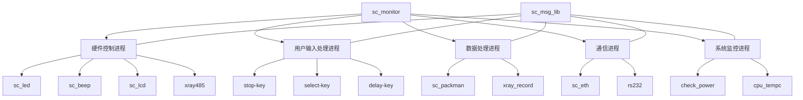
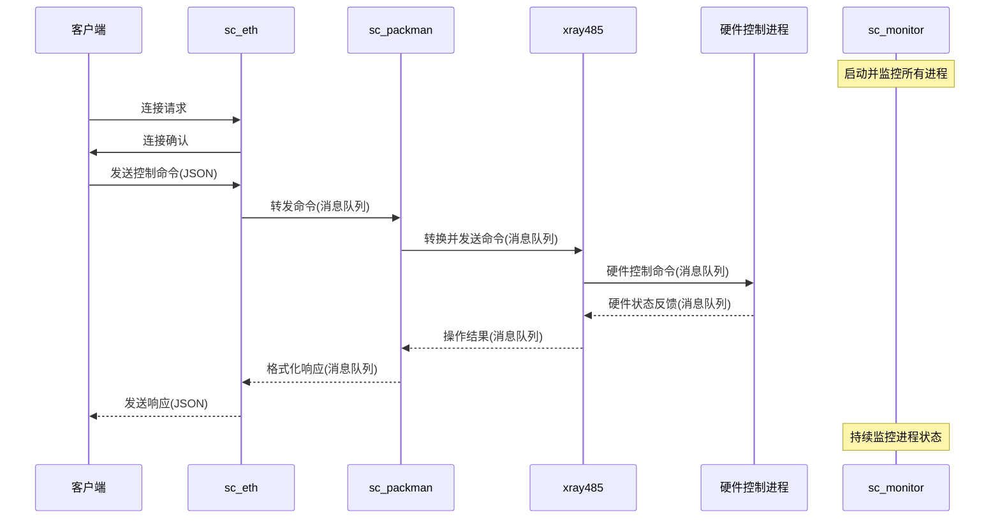

  
## 项目概述

  

TQT113_linux_V2.0 是一个基于 Linux 的嵌入式系统项目，主要用于 X 射线设备的控制和管理。该系统采用模块化设计，由多个独立进程组成，每个进程负责特定的功能，通过消息队列实现进程间通信。系统具有完善的硬件控制、安全保护和用户交互功能。

  

## 系统架构图

  



  

## 核心进程详细功能

  

### 1. sc_monitor

  

**功能**：系统监控和进程管理

  

**详细描述**：

- 作为守护进程运行，监控系统中所有关键进程的运行状态

- 为每个被监控的进程创建独立的监控线程

- 定期检查进程是否存活（通过 `ps` 命令）

- 当检测到进程异常退出时，自动重启该进程

- 监控的进程包括：sc_beep, sc_delay, xray485, sc_eth, sc_lcd, sc_led, sc_packman, sc_rs232, sc_select, sc_stop, sc_xray_record, cpu_tempc, check_power

  

**关键代码片段**：

```c

// 监控线程函数

void *monitor_process(void *arg)

{

    // ...

    while (1)

    {

        status = is_process_running(processes_name[index]);

        if (!status)

        {

            sleep(3);

            status = is_process_running(processes_name[index]);

            if (!status)

            {

                syslog(LOG_INFO, "Process %s is not running. Attempting to restart...", processes_name[index]);

                if (start_process(commands[index]) != 0) {

                    syslog(LOG_ERR, "Failed to restart process %s", processes_name[index]);

                }

            }

        }

        sleep(5);

    }

    // ...

}

```

  

### 2. sc_eth

  

**功能**：网络通信服务器

  

**详细描述**：

- 创建 TCP 服务器，监听指定端口（默认 8080）

- 接受客户端连接请求，为每个客户端创建独立的处理线程

- 接收客户端发送的数据，通过消息队列转发给相应的处理进程

- 从消息队列接收其他进程的响应数据，发送给客户端

- 监控网络连接状态，报告连接/断开事件

- 支持 JSON 格式的数据交换

  

**工作流程**：

1. 初始化 TCP 服务器，绑定端口

2. 等待客户端连接

3. 客户端连接后，创建读写线程

4. 读线程接收客户端数据，解析后通过消息队列发送给 sc_packman

5. 写线程从消息队列接收 sc_packman 的响应，发送给客户端

6. 客户端断开连接后，清理资源

  

**关键代码片段**：

```c

void *task_client_read(void *arg)

{

    // ...

    client = (clientinfo *)arg;

    packman_rec_queue_id = get_sc_msg_queue_id(PACKMAN_JSON_QUEUE_KEY);

    // 读取客户端数据并通过消息队列发送

    while ((read_size = sc_eth_read(client->client_fd, read_buf)) > 0)

    {

        // 解析接收到的消息

        parse_rx_msg(read_buf, &server_send_data, &read_size);

        // 发送到消息队列

        ret = queue_send_msg(packman_rec_queue_id, &server_send_data);

        // ...

    }

    // ...

}

```

  

### 3. xray485

  

**功能**：X 射线设备控制模块

  

**详细描述**：

- 通过 Modbus RTU 协议与 X 射线设备通信

- 控制 X 射线曝光参数（电压、电流）

- 读取 X 射线设备状态（温度、工作状态等）

- 实现安全保护机制，防止设备过热和过载

- 通过消息队列接收控制命令，发送设备状态

- 支持多种 Modbus 功能码，如读保持寄存器、写单个寄存器等

  

**工作流程**：

1. 初始化 Modbus RTU 通信（串口 /dev/ttySAC5）

2. 创建消息处理线程，从消息队列接收控制命令

3. 根据命令类型，执行相应的 Modbus 操作

4. 将操作结果通过消息队列发送给请求进程

5. 定期读取设备状态，监控设备安全

  

**关键代码片段**：

```c

int sc_modbus_read_input_registers(modbus_t *ctx, struct sc_queue_msg * rec_data_pointer, struct sc_queue_msg *send_data_pointer)

{

    // ...

    rc = modbus_read_input_registers(ctx, (rec_data_pointer_temp->sc_reg_addr),

                                    (rec_data_pointer_temp->sc_data_num),

                                    (rec_data_pointer_temp->sc_reg_data));

    // 处理响应数据

    send_data_pointer_temp->sc_device_addr = rec_data_pointer_temp->sc_device_addr;

    send_data_pointer_temp->sc_cmd = rec_data_pointer_temp->sc_cmd;

    send_data_pointer_temp->sc_reg_addr = rec_data_pointer_temp->sc_reg_addr;

    send_data_pointer_temp->sc_data_num = (rec_data_pointer_temp->sc_data_num*2);

    memcpy((send_data_pointer_temp->sc_reg_data), (rec_data_pointer_temp->sc_reg_data),

           SC_REGISTER_NUM*sizeof(u_int16_t));

    // ...

}

```

  

## 硬件驱动进程

  

### 4. sc_led

  

**功能**：LED 指示灯控制

  

**详细描述**：

- 控制系统状态指示灯，显示系统工作状态

- 通过消息队列接收控制命令

- 支持多种 LED 状态：常亮、闪烁、熄灭等

- 可能用于指示网络连接状态、X 射线工作状态、系统错误等

  

### 5. sc_beep

  

**功能**：蜂鸣器控制

  

**详细描述**：

- 提供声音提示功能

- 在 X 射线曝光等关键操作时发出警告

- 通过消息队列接收控制命令

- 支持不同的蜂鸣模式：短鸣、长鸣、间歇鸣等

- 可能用于提示操作完成、警告系统错误等

  

### 6. sc_lcd

  

**功能**：LCD 显示控制

  

**详细描述**：

- 控制 LCD 显示屏，显示系统状态和操作信息

- 可能提供用户界面，显示菜单和设置选项

- 通过消息队列接收显示内容更新命令

- 支持显示文本、数字、图标等

- 可能用于显示 X 射线参数、系统状态、错误信息等

  

### 7. rs232 (sc_rs232)

  

**功能**：串口通信控制

  

**详细描述**：

- 通过 RS232 接口与外部设备通信

- 配置串口参数（波特率、数据位、停止位等）

- 接收和发送串口数据

- 通过消息队列与其他进程交换数据

- 可能用于与计算机或其他控制设备通信

  

### 8. check_power

  

**功能**：电源状态监控

  

**详细描述**：

- 监控系统电源状态

- 检测电池电量

- 在低电量时发出警告

- 通过消息队列报告电源状态

- 可能实现电源管理功能，如低功耗模式切换

  

### 9. cpu_tempc

  

**功能**：CPU 温度监控

  

**详细描述**：

- 监控处理器温度

- 防止系统过热

- 通过消息队列报告温度状态

- 在温度过高时可能触发降频或关机保护

  

## 用户输入处理进程

  

### 10. stop-key

  

**功能**：停止按键处理

  

**详细描述**：

- 监控紧急停止按钮

- 在按下时立即停止 X 射线曝光

- 通过消息队列发送停止命令

- 实现安全保护功能

  

### 11. select-key

  

**功能**：选择按键处理

  

**详细描述**：

- 处理用户选择操作

- 可能用于菜单导航

- 通过消息队列发送选择命令

- 支持用户界面交互

  

### 12. delay-key

  

**功能**：延时按键处理

  

**详细描述**：

- 处理延时操作按键

- 可能用于设置 X 射线曝光延时

- 通过消息队列发送延时命令

- 支持定时曝光功能

  

## 数据处理进程

  

### 13. sc_packman

  

**功能**：数据包管理

  

**详细描述**：

- 处理和转发系统内部数据包

- 实现数据格式转换（如 JSON 转内部消息格式）

- 作为中央数据处理节点，连接网络通信和内部处理

- 通过消息队列与其他进程通信

- 可能实现数据过滤、验证和路由功能

  

### 14. xray_record

  

**功能**：X 射线记录管理

  

**详细描述**：

- 记录 X 射线曝光历史

- 存储曝光参数（电压、电流、时间等）

- 可能用于统计和分析

- 支持记录查询和导出

- 通过消息队列接收曝光事件

  

## 通信库

  

### 15. sc_msg_lib

  

**功能**：消息队列通信库

  

**详细描述**：

- 提供进程间通信机制

- 定义消息格式和处理函数

- 支持多种消息类型（RTU、温度、电池等）

- 实现消息发送和接收接口

- 为系统提供统一的通信框架

  

**消息队列键值定义**：

```c

//msg_queue_key

//XRAY-548

#define XRAY_REC_QUEUE_KEY 1352

//RS232-550

#define RS232_REC_QUEUE_KEY 1360

//LCD-558

#define LCD_REC_QUEUE_KEY 1368

//ETH-560

#define ETH_REC_QUEUE_KEY 1376

//RECORD-568

#define RECORD_REC_QUEUE_KEY 1384

//BEEP-570

#define BEEP_REC_QUEUE_KEY 1392

//LED-578

#define LED_REC_QUEUE_KEY 1400

//POWER-580

#define POWER_REC_QUEUE_KEY 1408

//POWER-588

#define PACKMAN_REC_QUEUE_KEY 1416

//STOP_KEY-590

#define STOP_KEY_REC_QUEUE_KEY 1424

//DELAY_KEY_MSG-598

#define DELAY_KEY_REC_QUEUE_KEY 1432

//JSON_KEY-5A0

#define PACKMAN_JSON_QUEUE_KEY 1440

```

  

**消息结构定义**：

```c

struct sc_queue_msg

{

    long int        msg_type;

    struct sc_msg   sc_msg_obj;

};

  

struct sc_msg

{

    time_t msg_time;

    struct sc_msg_content msg_content_obj;

};

  

struct sc_msg_content

{

    struct sc_rtu   rtu_obj;

    struct sc_tempc   tempc_obj;

    struct sc_battery   battery_obj;

    struct sc_packman   packman_obj;

};

```

  
  

## 系统工作流程图

  



  

## 测试程序

  

系统包含多个测试程序，用于单独测试各个硬件模块的功能：

  

- **test_led**：测试 LED 指示灯功能

- **test_beep**：测试蜂鸣器功能

- **test_lcd**：测试 LCD 显示功能

- **test_xray485**：测试 X 射线控制功能

- **test_rs232**：测试串口通信功能

- **test_select_key**：测试选择按键功能

- **test_stop_key**：测试停止按键功能

- **test_delay_key**：测试延时按键功能

- **test_check_power**：测试电源监控功能

- **test_cpu_tempc**：测试 CPU 温度监控功能

- **test_eth_server**：测试网络服务器功能

- **test_xray_record**：测试 X 射线记录功能

  

## 构建系统

  

系统使用 Buildroot 作为构建框架，提供了多个构建脚本：

  

- **build_all.sh**：构建所有模块

- **build_clean.sh**：清理构建文件

- **build_image.sh**：构建系统镜像

- **cppcheck_all.sh**：执行代码静态检查

- **kill_all.sh**：终止所有运行中的进程

- **dispatch_to_target.sh**：部署到目标设备

  

## 系统特点

  

1. **模块化设计**：系统被分解为多个独立进程，每个进程负责特定功能，便于开发和维护

2. **进程间通信**：使用消息队列实现进程间通信，定义了统一的消息格式，确保数据交换的一致性

3. **监控机制**：通过 sc_monitor 进程实现对其他进程的监控和管理，提高系统稳定性

4. **硬件抽象**：硬件操作被封装在专门的进程中，提高了系统可维护性和可移植性

5. **安全机制**：实现了多重安全保护，如温度监控、电源监控和紧急停止，确保系统安全运行

6. **网络连接**：支持网络通信，可以通过网络远程控制和监控系统

7. **数据记录**：记录系统运行数据，支持历史查询和分析

  

## 总结

  

TQT113_linux_V2.0 是一个功能完善的嵌入式 Linux 系统，主要用于 X 射线设备的控制和管理。系统采用多进程架构，通过消息队列实现进程间通信，具有良好的模块化设计和可维护性。系统实现了完善的硬件控制、安全保护和用户交互功能，可以满足 X 射线设备的各种应用需求。